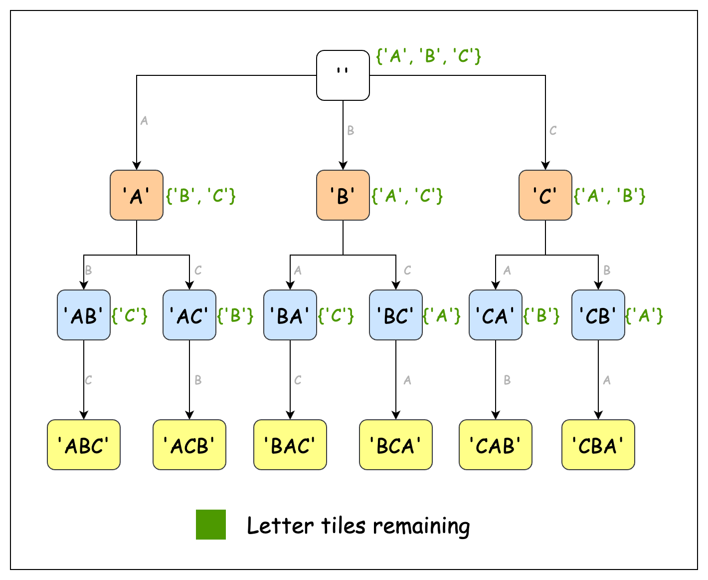

<!-- @leetcode -->

# 1079. Letter Tile Possibilities

You have `n` tiles, where each tile has one letter `tiles[i]` printed on it.

Return the number of possible non-empty sequences of letters you can make using the letters printed on those tiles.

**Example 1**:

**Input**: tiles = "AAB"

**Output**: 8

**Explanation**: The possible sequences are "A", "B", "AA", "AB", "BA", "AAB", "ABA", "BAA".

**Example 2**:

**Input**: tiles = "AAABBC"

**Output**: 188

**Example 3**:

**Input**: tiles = "V"

**Output**: 1

**Constraints**:

- `1 <= tiles.length <= 7`
- tiles consists of uppercase English letters.

# Solution

## Approach 1: Recursion

### Intuition

Let's think about how we naturally form different sequences from a set of letters. Imagine we have Scrabble tiles with the letters 'A', 'A', and 'B'. How would we manually find all possible sequences? We would likely start with single letters ("A", "B"), then try two-letter combinations ("AA", "AB"), and finally three-letter combinations ("AAB").

A point to note in this manual process is that at each step, we make a choice about whether to use each available letter. For example, when starting with "AAB", we first decide: "Should I use the first 'A'?" If we use it, we then face the same type of decision with our remaining letters. If we don't use it, we still have all our letters available for future choices.

This decision-making pattern, where each choice reduces the problem to a smaller version of itself and follows a repetitive structure, naturally suggests a recursive approach. At each level of the recursion (or decision point), we have two options: either use an available letter and continue exploring, or skip it and move to the next letter.

The diagram below illustrates the structure of a recursion tree for this problem: 

However, there's a subtle complexity we need to address. Consider the input `"AAB"` again. If we're not careful, we might count the same sequence multiple times because we have duplicate letters. For instance, we could form "AB" by using either the first or second `'A'`.

To solve this, we’ll store all the sequences we generate in a hash set. Hash sets allow for quick lookups and keep the characters unique due to the set property, so we can check whether a particular sequence has already been found.

Let's create a recursive function `generateSequences` which creates all possible letter sequences. We'll also maintain a boolean array `used` of size equal to that of tiles. Each index in `used` tells us whether the character at that index in tiles has been used in the current sequence or not.

The first step in the recursive function is to add the current sequence to the hash set. This is because all intermediate sequences are also valid combinations and not just the ones where we use all the tiles. Next, we’ll iterate over each character in tiles. If a character hasn’t been used yet, we’ll add it to the current sequence and recurse. After exploring that path, we’ll backtrack and mark the letter as unused to allow us to try different combinations.

We start the recursion by calling the function with an empty string. When the recursion completes, the hash set will contain all possible letter combinations. Finally, we return the size of the hash set minus one, since the problem asks for non-empty sequences only.

> For a more comprehensive understanding of hash tables, check out the Hash Table Explore Card. This resource provides an in-depth look at hash tables, explaining their key concepts and applications with a variety of problems to solidify understanding of the pattern.

### Algorithm

- Initialize:
  - a hash set called `sequences` to store the unique sequences.
  - a variable `len` to store the length of the input string tiles.

- Create a boolean array `used` of size `len` to track the used characters

- Call the recursive helper function `generateSequences` with the initial parameters: `tiles`, an empty string, `used` array, and the `sequences` set.

- Return the size of the `sequences` set minus `1` (to exclude the empty string).

Helper method `generateSequences(tiles, current, used, sequences)`:

- Add the current sequence to the sequences set.

- Initialize a loop that runs from position 0 to the length of tiles. For each position:
  - Check if the character at the current position is not used. If not used:
    - Mark the current position as used in the used array.
    - Make a recursive call with: tiles, current string + character at the current position, used array, and sequences set.
    - After the recursive call returns, mark the current position as unused (backtrack).

- When the loop ends, return to the previous recursive call.

```python
class Solution:
    def numTilePossibilities(self, tiles: str) -> int:
        sequences = set()
        used = [False] * len(tiles)

        # Generate all possible sequences including empty string
        self._generate_sequences(tiles, "", used, sequences)

        # Subtract 1 to exclude empty string from count
        return len(sequences) - 1

    def _generate_sequences(
        self, tiles: str, current: str, used: list, sequences: set
    ) -> None:
        sequences.add(current)

        # Try adding each unused character to current sequence
        for pos, char in enumerate(tiles):
            if not used[pos]:
                used[pos] = True
                self._generate_sequences(tiles, current + char, used, sequences)
                used[pos] = False
```

## Approach 2: Optimized Recursion

### Intuition

Imagine we're playing with Scrabble tiles again, but this time we have the string "AAABBC". We can make an important observation here: what really matters isn't the position of each letter, but rather how many of each letter we have available. Whether we use the first 'A' or the second 'A' doesn't change the sequences we can create - we just need to know we have three 'A's to work with.

This insight leads us to our first key decision: instead of tracking individual letters, we can track the frequency of each letter. Think of it like having separate piles for each letter - three tiles in the 'A' pile, two in the 'B' pile, and one in the 'C' pile. To implement this, we can maintain an array `charCount` where each index represents a letter (0 for 'A', 1 for 'B', etc.), and the value represents how many of that letter we have.

Now, let's think about how we build sequences using these frequency counts. At each step, we're asking ourselves: "Which letter should I add to my current sequence?" We can loop over all 26 letters and use any letter that still has a positive count. This is fundamentally different from our previous approach where we were making yes/no decisions about each position in `tiles`.

This incremental building of the sequence using the remaining letters suggests a recursive approach. We'll pass `charCount` to the recursive function and start building the sequence by eliminating each available character one by one. Remember that we also need to count all intermediate sequences (where `charCount` is not empty yet), because these are also valid letter tile possibilities.

Notice that nowhere in our algorithm do we work with the actual sequence itself. Each unique sequence is determined by the number of letters available in `charCount`, not the sequence. This means we no longer need to maintain a hash set to store visited sequences, saving significant space.

Our main function calls the recursive method with the full `charCount` array. The result returned by it is our required answer.

### Algorithm

- Initialize an integer array `charCount` of size 26 to store the frequency of each uppercase letter.

- Iterate through each character of `tiles`:
  - Increment the count at the index (character - 'A') in the `charCount` array.

- Call the recursive helper function `findSequences` with the `charCount` array.
- Return the result from `findSequences`.

Helper method `findSequences(charCount)`:

- Initialize a variable `totalCount` to `0` to track the number of possible sequences.

- Start a loop that runs from position `0` to `25` (for 26 letters):
  - Check if the count of the current character is `0`. If `true`:
    - Skip to the next iteration.
  - If not `0`:
    - Increment `totalCount` by `1` (counting the current character as a sequence).
    - Decrement the count of the current character in the `charCount` array.
    - Make a recursive call with the updated `charCount` array.
    - Add the result of the recursive call to `totalCount`.
    - Increment the count of the current character back (backtrack).

- Return `totalCount`.

```python
class Solution:
    def numTilePossibilities(self, tiles: str) -> int:
        # Track frequency of each uppercase letter (A-Z)
        char_count = [0] * 26
        for char in tiles:
            char_count[ord(char) - ord("A")] += 1

        # Find all possible sequences using character frequencies
        return self._find_sequences(char_count)

    def _find_sequences(self, char_count: list) -> int:
        total = 0

        # Try using each available character
        for pos in range(26):
            if char_count[pos] == 0:
                continue

            # Add current character and recurse
            total += 1
            char_count[pos] -= 1
            total += self._find_sequences(char_count)
            char_count[pos] += 1

        return total
```

## Approach 3: Permutations and Combinations

### Intuition

Consider a sequence "ABC". Generating it actually has two steps:

1. Choosing the three tiles 'A', 'B', and 'C'.
2. Arranging them in order to form "ABC".

Notice that after step 1, we can create 5 more sequences: "BAC", "CBA", "BCA", "ACB", and "CAB." These are all the permutations of "ABC".

The total number of permutations that can be generated from `n` unique characters is `n!`. For the characters 'A', 'B', and 'C', the number of unique characters is 3, so 6 sequences can be generated from them.

However, we need to account for cases where there are multiple occurrences of the same character. For example, consider the tiles 'A', 'A', and 'B'. This will generate only 3 unique sequences of length 3: "AAB", "ABA", and "BAA". This is because swapping the first and second 'A' doesn’t create a new sequence, so they can’t be counted separately.

To account for this, we modify our formula to the following: if we have 3 characters with frequencies $n_1$, $n_2$, and $n_3$, the number of 3 length sequences are

$$ \frac{(n_1 + n_2 + n_3)}{(n_1)! \cdot (n_2)! \cdot (n_3)!} $$

The above formula can be extended to `m` characters of different frequencies.

So now, our task is to generate all combinations of characters from the given tiles. We can use a recursive method to do this. The function iterates over the tiles string and makes two choices at each step: whether to pick the current character or not. This generates all possible combinations of characters, which we then pass to a helper method called `countPermutations`.

The `countPermutations` method counts the frequency of each character in the generated combination using an array called `charCount` (similar to the previous approach). It then applies the formula above to calculate all possible permutations of the current combination.

The total permutations for each combination are returned by the recursive function. The cumulative sum of all such combinations is our final answer, which we return at the end.

```python
class Solution:
    def numTilePossibilities(self, tiles: str) -> int:
        seen = set()

        # Sort characters to handle duplicates efficiently
        sorted_tiles = "".join(sorted(tiles))

        # Find all unique sequences and their permutations
        return self._generate_sequences(sorted_tiles, "", 0, seen) - 1

    def _factorial(self, n: int) -> int:
        if n <= 1:
            return 1

        result = 1
        for num in range(2, n + 1):
            result *= num
        return result

    def _count_permutations(self, seq: str) -> int:
        # Calculate permutations using factorial formula
        total = self._factorial(len(seq))

        # Divide by factorial of each character's frequency
        for count in Counter(seq).values():
            total //= self._factorial(count)

        return total

    def _generate_sequences(
        self, tiles: str, current: str, pos: int, seen: set
    ) -> int:
        if pos >= len(tiles):
            # If new sequence found, count its unique permutations
            if current not in seen:
                seen.add(current)
                return self._count_permutations(current)
            return 0

        # Try including and excluding current character
        return self._generate_sequences(
            tiles, current, pos + 1, seen
        ) + self._generate_sequences(tiles, current + tiles[pos], pos + 1, seen)
```
