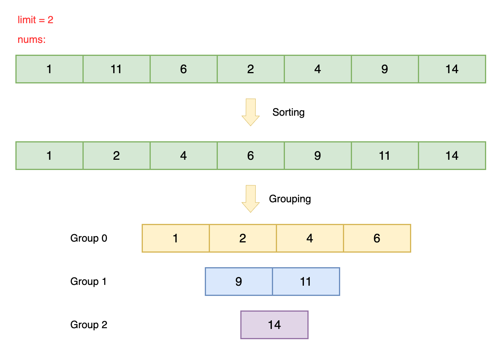

<!-- @leetceode -->

# Make Lexicographically Smallest Array by Swapping Elements

# Problem

You are given a **0-indexed** array of **positive** integers `nums` and a **positive** integer `limit`.

In one operation, you can choose any two indices `i` and `j` and swap `nums[i]` and `nums[j]` if `|nums[i] - nums[j]| <= limit`.

Return the **lexicographically smallest array** that can be obtained by performing the operation any number of times.

An array `a` is lexicographically smaller than an array `b` if in the first position where `a` and `b` differ, array `a` has an element that is less than the corresponding element in `b`. For example, the array `[2,10,3]` is lexicographically smaller than the array `[10,2,3]` because they differ at index `0` and `2 < 10`.

## Example 1:

Input: nums = [1,5,3,9,8], limit = 2
Output: [1,3,5,8,9]
Explanation: Apply the operation 2 times:

- Swap nums[1] with nums[2]. The array becomes [1,3,5,9,8]
- Swap nums[3] with nums[4]. The array becomes [1,3,5,8,9]
We cannot obtain a lexicographically smaller array by applying any more operations.
Note that it may be possible to get the same result by doing different operations.

## Example 2:

Input: nums = [1,7,6,18,2,1], limit = 3
Output: [1,6,7,18,1,2]
Explanation: Apply the operation 3 times:

- Swap nums[1] with nums[2]. The array becomes [1,6,7,18,2,1]
- Swap nums[0] with nums[4]. The array becomes [2,6,7,18,1,1]
- Swap nums[0] with nums[5]. The array becomes [1,6,7,18,1,2]
We cannot obtain a lexicographically smaller array by applying any more operations.

## Example 3:

Input: nums = [1,7,28,19,10], limit = 3
Output: [1,7,28,19,10]
Explanation: [1,7,28,19,10] is the lexicographically smallest array we can obtain because we cannot apply the operation on any two indices.

# Solution

## Overview

We are given an array `nums` in which we can swap any two elements `nums[i]` and `nums[j]` if their absolute difference is less than or equal to `limit`. We want to find the lexicographically smallest possible array we can make by applying this swap operation an unlimited number of times on `nums`.

Lexicographical order compares arrays element by element, starting from the leftmost index. For two arrays, the comparison stops as soon as we find an index where the elements differ:

The array with the smaller element at this differing index is considered smaller.
If all elements are the same up to the shorter array's length, the shorter array is considered smaller.
For the example arrays given in the problem description, `[2,10,3]` and `[10,2,3]`, the first elements don't match: `2 < 10`, so `[2,10,3]` is lexicographically smaller.

Let's look at another example: For `[1, 1, 3, 5]` and `[1, 1, 2, 7, 9]`, the first occurrence in which the elements do not match is at index `2: 2 < 3` so `[1, 1, 2, 7, 9]` is lexicographically smaller.

## Approach: Sorting + Grouping

### Intution

Our goal is to perform valid swap operations on `nums` so that it is as lexicographically small as possible. After looking at the examples in the overview, we see that to make a lexicographically small array, we would like smaller values to be more towards the front, while larger values are pushed to the back. We will now investigate what sort of rearrangements are possible in order to achieve this ordering.

Consider the array `[5, 3, 1]` with `limit = 2`:

- `1` and `3` can be swapped because `∣3−1∣=2≤limit`.
- Similarly, `3` and `5` can be swapped because `∣5−3∣=2≤limit`.
- On the other hand, `1` and `5` cannot be swapped directly because `∣5−1∣=4>limit`.

Even though `1` and `5` cannot be swapped directly, we notice that they can effectively be swapped through a chain of intermediate swaps where `1` gets swapped with `3` and `3` gets swapped with `5`:


In other words, this swapping is transitive: If `a` can swap with `b`, and `b` can swap with `c`, then `a` can effectively be swapped with `c`. Through this transitive property, we know that all elements in the example array can be swapped with each other (because they all belong in this transitive swapping chain). Because of this, any rearrangement/permutation can also be done. For this problem, we want the elements in increasing order to achieve the smallest lexicographic value, so we know `[1, 3, 5]` is the lexicographically smallest possible array that can be made.

Now that we know about this transitive property, it would be useful to see which elements in `nums` can be rearranged together like shown above. Specifically, we want to organize `nums` into groups, so that all elements in a given group can participate in this transitive chaining and can thus be reordered in our desired increasing order.

To do this, we can first sort `nums` in increasing order. We can then iterate through each num in nums and compare it to its previous element to see if their absolute difference is within `limit`. If it is, then `num` belongs in the same running group. Otherwise, the chain is broken and a new group containing `num` is created.


To keep track of groups, we can use a hash map `numToGroup`, where the key is the element and the value is the group number (the group number can be initialized to 0 and incremented each time a new group is created). Similarly, to keep track of the list of elements comprising each group, we can use another hash map `groupToList` where the key is the group number and the value is the sorted list of elements belonging to the group.

After this process, we now know what group each element in nums belongs to, and that elements in each group can be freely rearranged:


Once we've grouped the elements, we return to the original array. For each element, we check its group using numToGroup and overwrite it with the next smallest element from that group. This ensures the elements in each group are placed in ascending order, resulting in the smallest possible lexicographic arrangement.


### Algorithm

- Create a sorted copy of the input array nums called `numsSorted`.

- Initialize variables:
  - `currGroup` to track the current group index.
  - `numToGroup`, a map to associate each number with its group.
  - `groupToList`, a map to associate each group with a list of numbers that belong to it.

- Sort the `numsSorted` array.
- Assign the first element of `numsSorted` to group `0`:
- Add the element to `groupToList` under group `0`.

- Iterate through the rest of `numsSorted`:
  - If the difference between the current element and the previous one is greater than `limit`, increment `currGroup` (indicating a new group).
  - Assign the current element to the correct group in `numToGroup`.
  - Add the element to the corresponding list in `groupToList`.

- Iterate through the original `nums` array:
  - For each element, retrieve its group from `numToGroup`.
  - Replace the element with the next element from its corresponding group in `groupToList`.

- Return the modified `nums` array, which is now the lexicographically smallest array after applying the group-wise sorting.
  
```python
class Solution:
    def lexicographicallySmallestArray(self, nums, limit):
        nums_sorted = sorted(nums)

        curr_group = 0
        num_to_group = {}
        num_to_group[nums_sorted[0]] = curr_group

        group_to_list = {}
        group_to_list[curr_group] = deque([nums_sorted[0]])

        for i in range(1, len(nums)):
            if abs(nums_sorted[i] - nums_sorted[i - 1]) > limit:
                # new group
                curr_group += 1

            # assign current element to group
            num_to_group[nums_sorted[i]] = curr_group

            # add element to sorted group deque
            if curr_group not in group_to_list:
                group_to_list[curr_group] = deque()
            group_to_list[curr_group].append(nums_sorted[i])

        # iterate through input and overwrite each element with the next element in its corresponding group
        for i in range(len(nums)):
            num = nums[i]
            group = num_to_group[num]
            nums[i] = group_to_list[group].popleft()

        return nums
```

### Complexity Analysis

Let `N` be the size of `nums`.

- Time Complexity: O(N⋅logN)
  Sorting nums takes `O(N⋅logN)` time. Iterating through each element in sortedNums and updating our two maps takes `O(N)` time. Iterating through `nums` to overwrite its values with the sorted list values in each group takes a total of `O(N)` time. Thus, the total time complexity is `O(N⋅logN)`.

- Space Complexity: `O(N+$S_{N}$)≈O(N)`
  Both our maps have a space complexity of `N`. The space complexity used for sorting `nums` depends on the language of implementation:
  
  In Python, the `sort()` method sorts a list using the Timsort algorithm which is a combination of Merge Sort and Insertion Sort and has a space complexity of `O(N)`.

Thus, the total space complexity is `O(N+ $S_{N}$)≈O(N)`.
