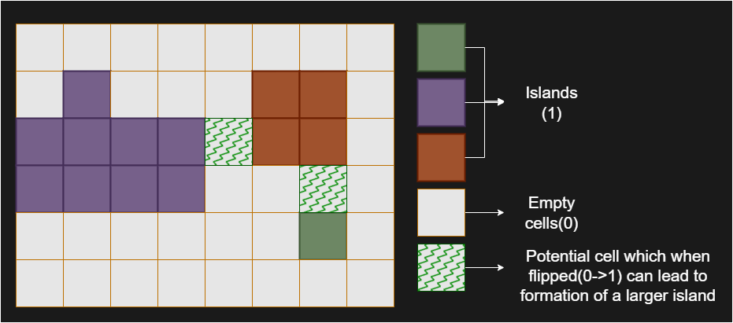

<!-- leetcode -->

# 827. Making A Large Island

You are given an `n x n` binary matrix `grid`. You are allowed to change at most one `0` to be `1`.

Return the size of the **largest island** in `grid` after applying this operation.

An **island** is a 4-directionally connected group of `1`s.

**Example 1**:

**Input**: grid = [[1,0],[0,1]]
**Output**: 3
**Explanation**: Change one 0 to 1 and connect two 1s, then we get an island with area = 3.

**Example 2**:

**Input**: grid = [[1,1],[1,0]]
**Output**: 4
**Explanation**: Change the 0 to 1 and make the island bigger, only one island with area = 4.

**Example 3**:

**Input**: grid = [[1,1],[1,1]]
**Output**: 4
**Explanation**: Can't change any 0 to 1, only one island with area = 4.

**Constraints**

- `n == grid.length`
- `n == grid[i].length`
- `1 <= n <= 500`
- `grid[i][j]` is either `0` or `1`.

# Solution

## Approach 1: Using DFS

### Intuition

We are given a binary matrix where each cell is either `0` (representing water) or `1` (representing land) and the ability to flip at most one `0` to `1`. Our task is to find the **largest island** in the matrix, or in other words, **the largest group of 1s connected** with each other either up, down, left, or right (4-directionally) after the flip operation.

At first, we might think of flipping each `0` to `1` and then calculating the size of the largest island in the modified matrix. However, this brute-force approach is inefficient, especially for larger grids, as it involves multiple recalculations for each flip, which would lead to Time Limit Exceeded (TLE) error.

Instead of recalculating island sizes for every flip, we can take advantage of the fact that flipping a single `0` only affects the islands adjacent to it. Specifically, flipping a `0` merges neighboring islands into one larger island. This insight allows us to efficiently compute the largest island after flipping by precomputing the sizes of all islands first.

Check out the diagram below, where we can see that we can merge two islands into one by flipping a zero in between. 

We start by traversing the grid and identifying all the islands using Depth-First Search (DFS). During this traversal, we give each island a unique identifier (like a color). At the same time, we also calculate and store the size of each island in a map, where the key is the island’s unique identifier and the value is its size. This precomputation allows us to avoid recalculating island sizes later.

> **Note:** For a more comprehensive understanding of depth-first search, check out the DFS Explore Card.

After labeling the islands and knowing their sizes, we then look at each `0` in the grid. Flipping a `0` to `1` might connect neighboring islands, creating a larger island. For each `0`, we examine the islands around it and collect their unique identifiers using a set (to avoid counting the same island more than once). We then sum up the sizes of these islands to calculate the size of the new island that would be formed if this `0` were flipped to `1`.

As we evaluate each potential flip, we compare the size of the island that would be formed with the largest island we’ve seen so far. This ensures that we find the largest possible island we can form by flipping a single `0`. We will handle special edge cases (e.g., the grid is full with 1s or 0s) separately.

This strategy is efficient because the grid is only traversed twice:

1. To label the islands and compute their sizes.
2. To evaluate the potential island size for each `0` flip.

### Algorithm

`exploreIsland` helper function:

- Define the `exploreIsland` function which recursively explores an island with the given id islandId starting from the given cell (`currentRow`, `currentColumn`).

- Check if the current cell is out of bounds, is not part of an island or is already visited (i.e., its value is not 1):
  - If so, return `0`, indicating no land is found at this cell.

- Mark the current cell with the given `islandId` to indicate it has been visited.

- Recursively explore the four neighboring cells (up, down, left, right) and accumulate the area of the island:
  - Call `exploreIsland` for the cell below (`currentRow + 1`, `currentColumn`).
  - Call `exploreIsland` for the cell above (`currentRow - 1`, `currentColumn`).
  - Call `exploreIsland` for the cell to the right (`currentRow`, `currentColumn + 1`).
  - Call `exploreIsland` for the cell to the left (`currentRow`, `currentColumn - 1`).

- Return the total area of the island (i.e., 1 + the sum of all reachable land cells from the current position).

`largestIsland` main function:

- Initialize `islandSizes` to store sizes of islands, and islandId `starting` at 2 (to mark islands).

- Traverse through the grid to mark all islands and calculate their sizes:
  - For each cell in the grid, if the cell contains a land (value 1), call `exploreIsland()` to mark the island and calculate its size.
  - For each island, store the size in `islandSizes` using the islandId as the key and increment islandId for the next island.
  - Check if there are no islands (empty grid), in which case return 1 (since flipping one 0 would form a new island).

- If only one island exists in the entire grid, check if the size of that island is equal to the total grid size:
  - If `true`, return the size of the island.
  - Otherwise, return the size of the island + 1 (as we can expand the island by flipping one `0`).

- Initialize `maxIslandSize` to 1, which will store the size of the largest island.

- Traverse through the grid again to try converting each `0` to a `1` and calculate the resulting island size:
  - For each `0`, check its neighboring cells (up, down, left, right) to find which islands are connected to it.
  - Use a unordered set to store unique neighboring island IDs.
  - Sum the sizes of all unique neighboring islands and add `1` (to account for the flipped `0` turning into a `1`).
  - Update `maxIslandSize` with the maximum island size found.

- Return `maxIslandSize`, the size of the largest island after trying to expand all possible `0s`.

```python
class Solution:
    def largestIsland(self, grid: List[List[int]]) -> int:
        island_sizes = {}
        island_id = 2

        # Step 1: Mark all islands and calculate their sizes
        for current_row in range(len(grid)):
            for current_column in range(len(grid[0])):
                if grid[current_row][current_column] == 1:
                    island_sizes[island_id] = self.explore_island(
                        grid, island_id, current_row, current_column
                    )
                    island_id += 1

        # If there are no islands, return 1
        if not island_sizes:
            return 1

        # If the entire grid is one island, return its size or size +
        if len(island_sizes) == 1:
            island_id -= 1
            return (
                island_sizes[island_id]
                if island_sizes[island_id] == len(grid) * len(grid[0])
                else island_sizes[island_id] + 1
            )

        max_island_size = 1

        # Step 2: Try converting every 0 to 1 and calculate the resulting island size
        for current_row in range(len(grid)):
            for current_column in range(len(grid[0])):
                if grid[current_row][current_column] == 0:
                    current_island_size = 1
                    neighboring_islands = set()

                    # Check down
                    if (
                        current_row + 1 < len(grid)
                        and grid[current_row + 1][current_column] > 1
                    ):
                        neighboring_islands.add(
                            grid[current_row + 1][current_column]
                        )

                    # Check up
                    if (
                        current_row - 1 >= 0
                        and grid[current_row - 1][current_column] > 1
                    ):
                        neighboring_islands.add(
                            grid[current_row - 1][current_column]
                        )

                    # Check right
                    if (
                        current_column + 1 < len(grid[0])
                        and grid[current_row][current_column + 1] > 1
                    ):
                        neighboring_islands.add(
                            grid[current_row][current_column + 1]
                        )

                    # Check left
                    if (
                        current_column - 1 >= 0
                        and grid[current_row][current_column - 1] > 1
                    ):
                        neighboring_islands.add(
                            grid[current_row][current_column - 1]
                        )

                    # Sum the sizes of all unique neighboring islands
                    for island_id in neighboring_islands:
                        current_island_size += island_sizes[island_id]
                    max_island_size = max(max_island_size, current_island_size)

        return max_island_size

    def explore_island(
        self,
        grid: List[List[int]],
        island_id: int,
        current_row: int,
        current_column: int,
    ) -> int:
        if (
            current_row < 0
            or current_row >= len(grid)
            or current_column < 0
            or current_column >= len(grid[0])
            or grid[current_row][current_column] != 1
        ):
            return 0

        grid[current_row][current_column] = island_id

        return (
            1
            + self.explore_island(
                grid, island_id, current_row + 1, current_column
            )
            + self.explore_island(
                grid, island_id, current_row - 1, current_column
            )
            + self.explore_island(
                grid, island_id, current_row, current_column + 1
            )
            + self.explore_island(
                grid, island_id, current_row, current_column - 1
            )
        )
```

### Complexity Analysis

Let `n` be the number of rows in the `grid`, `m` be the number of columns in the grid.

- Time complexity: `O(n×m)`
  
  The algorithm consists of two main phases. In the first phase, we iterate over every cell in the grid to identify and mark islands using a Depth-First Search (DFS) approach. During this process, each cell is visited at most once, ensuring that the DFS traversal contributes O(n×m) to the time complexity.
  
  In the second phase, we iterate over every cell again to explore the possibility of converting each 0 to 1 and calculating the potential island size. For each 0, we check its four neighboring cells, which is a constant-time operation. The use of an unordered set ensures that neighboring islands are counted uniquely, and the total work done in this phase is also O(n×m).
  
  Thus, the overall time complexity is dominated by the grid traversal and DFS, resulting in O(n×m).

- Space complexity: `O(n×m)`
  
  The space complexity is primarily determined by the recursion stack used during the DFS traversal and the storage required for the unordered map that keeps track of island sizes. In the worst case, the recursion depth of the DFS can be O(n×m) if the entire grid forms a single large island. The unordered map stores the sizes of all islands, and in the worst case, the number of islands can be proportional to the number of cells, contributing `O(n×m)` to the space complexity.
  
  Furthermore, the unordered set used to store neighboring islands for each 0 cell has a maximum size of 4, as there are only four possible neighboring cells. This does not significantly impact the overall space complexity.
  
  Therefore, the dominant factors are the recursion stack and the unordered map, resulting in an overall space complexity of `O(n×m)`.
