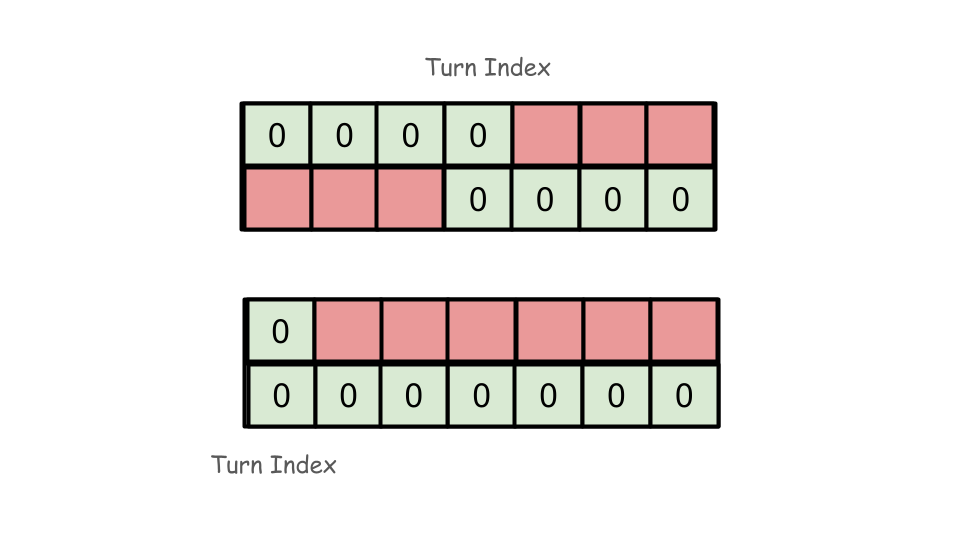
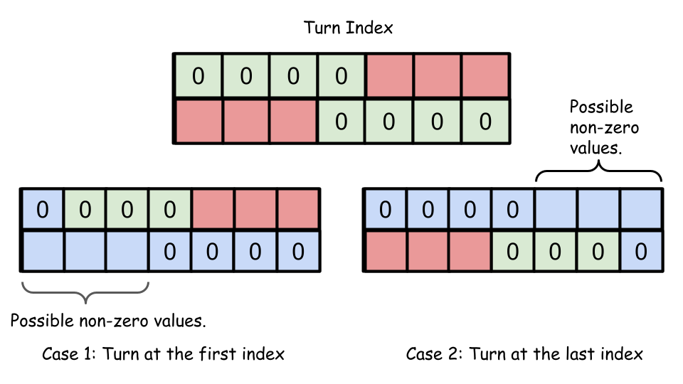

# Solution

## Overview

We are given a matrix `grid` containing 2 rows and `n` columns. Each cell contains a value representing the number of points for that cell in the `grid`. Two robots are playing a game where they are initially positioned at `(0, 0)` and aim to reach `(1, n - 1)`.

Each robot can only move right or down in the `grid`. The task is to compute the points collected by the second robot, given the strategies of both robots.

The challenge is that the first robot moves first, and its goal is to reduce the points available for the second robot. The second robot then takes the best path to collect as many points as possible.

## Approach: Prefix and Suffix Sum

### Intuition

A key observation from the overview is that the number of opportunities the second robot has to move to the bottom row corresponds to the number of columns in the grid. When the first robot collects all the points on its way, it leaves a pattern of `0`-valued cells behind. The pattern looks like this: there will be some `0`-valued consecutive cells (possibly none) in the first row, two `0`-valued cells in the same column where it moves to the bottom row, and the remaining cells in the bottom row are also `0`-valued. This creates a "cut" through the grid where the first robot has moved, leaving the rest of the grid available for the second robot.



Now, consider the choices left for the second robot:

- The second robot must now choose how to move, given that parts of the grid are now blocked by the first robot's path. If the second robot moves to the second row at a point further down than where the first robot turned, it will need to collect points from the first row from that point onward. Since the bottom row is already collected, the optimal strategy for the second robot will be to collect points from the remaining cells of the top row before it reaches its target.

- Alternatively, the second robot could move to the second row at the first column and collect all the points in the second row until it reaches the point where the first robot made its turn.

Refer to the image provided for better understanding:



To summarize, we have only two possibilities for the second robot, assuming the first robot moves to the next row at index turnIndex:

- Option 1: Collect all points in the first row after the point where the first robot moved down.
- Option 2: Collect all points in the second row before the point where the first robot moved down.

To optimize the second robot's decision-making, we maintain two running sums:

- `firstRowSum`: The sum of points in the first row, initially set to the sum of all the points in the first row.
- `secondRowSum`: The sum of points in the second row, initially set to the sum of all the points in the second row.

As we iterate through all possible values for the first robot’s turn (turnIndex), we adjust these sums to reflect the points the second robot can collect based on its own movement strategy. Specifically:

1. For each turnIndex, calculate the sum of points the second robot would collect if it follows Option 1 (from the first row after the turnIndex).
2. Alternatively, calculate the sum if it follows Option 2 (from the second row before the turnIndex).

Finally, we compute the smallest value among the largest outcomes of these two strategies (because the goal is to reduce the highest possible points the second robot can collect).

> Notice that the problem is not the same as finding the highest number of points the first robot can collect. For example, if grid = [[2, 4, 6], [8, 9, 10]], the first robot could take the path 2 -> 8 -> 9 -> 10 to maximize its points, leaving 4 and 6 for the second robot. But the better strategy is for the first robot to turn down at index 1, leaving either 6 or 8 for the second robot, which would then get max(6, 8) = 8 points instead of 10.

### Algorithm 

1. Initialize `firstRowSum` with the sum of all elements in the first row of `grid`. `Initialize` secondRowSum as `0`.
2. Set `minimumSum` to a very large value (`LONG_LONG_MAX`).
3. Iterate through the indices of the first row:
   - Subtract the current element of the first row from `firstRowSum`.
   - Calculate the maximum value between `firstRowSum` and `secondRowSum`; This would be the highest number of points the second robot can get if the first robot turns down at the current index.
   - Update `minimumSum` with the smaller value between `minimumSum` and the calculated maximum.
   - Add the current element of the second row to `secondRowSum`.
4. Return `minimumSum`.

```python
class Solution:
    def gridGame(self, grid: List[List[int]]) -> int:
        first_row_sum = sum(grid[0])
        second_row_sum = 0
        minimum_sum = float("inf")
        for turn_index in range(len(grid[0])):
            first_row_sum -= grid[0][turn_index]
            # Find the minimum maximum value out of first_row_sum and
            # second_row_sum.
            minimum_sum = min(minimum_sum, max(first_row_sum, second_row_sum))
            second_row_sum += grid[1][turn_index]
        return minimum_sum
```

### Complexity Analysis

Let `n` be the number of columns in the `grid`.

Time Complexity: `O(n)`

The algorithm iterates through each column of the `grid` exactly once. For each column, it updates the sums of the first and second rows and computes the minimum of the maximum values. These operations take constant time for each column. Therefore, the overall time complexity is `O(n)`.

Space Complexity: `O(1)`
The algorithm uses a constant amount of extra space, including variables for firstRowSum, secondRowSum, and minimumSum. No additional data structures proportional to the size of the input are used. Thus, the overall space complexity is `O(1)`.
