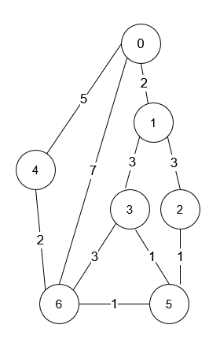

# 1976. Number of Ways to Arrive at Destination

You are in a city that consists of `n` intersections numbered from `0` to `n - 1` with `bi-directional` roads between some intersections. The inputs are generated such that you can reach any intersection from any other intersection and that there is at most one road between any two intersections.

You are given an integer `n` and a 2D integer array `roads` where `roads[i] = [u_i, v_i, time_i]` means that there is a road between intersections `u_i` and `v_i` that takes `time_i` minutes to travel. You want to know in how many ways you can travel from intersection `0` to intersection `n - 1` in the shortest amount of time.

Return the number of ways you can arrive at your destination in the shortest amount of time. Since the answer may be large, return it modulo `10^9 + 7`.

**Example 1**:

**Input**: n = 7, roads = [[0,6,7],[0,1,2],[1,2,3],[1,3,3],[6,3,3],[3,5,1],[6,5,1],[2,5,1],[0,4,5],[4,6,2]]

**Output**: 4

**Explanation**:


The shortest amount of time it takes to go from intersection 0 to intersection 6 is 7 minutes.
The four ways to get there in 7 minutes are:

- 0 ➝ 6
- 0 ➝ 4 ➝ 6
- 0 ➝ 1 ➝ 2 ➝ 5 ➝ 6
- 0 ➝ 1 ➝ 3 ➝ 5 ➝ 6

**Example 2**:

**Input**: n = 2, roads = [[1,0,10]]
**Output**: 1
**Explanation**: There is only one way to go from intersection 0 to intersection 1, and it takes 10 minutes.

**Constraints**:

- `1 <= n <= 200`
- `n - 1 <= roads.length <= n * (n - 1) / 2`
- `roads[i].length == 3`
- `0 <= u_i, v_i <= n - 1`
- `1 <= timei <= 10^9`
- `u_i != v_i`
- There is at most one road connecting any two intersections.
- You can reach any intersection from any other intersection.

# Solution

## Overview

We have `n` intersections in a city, represented as nodes in a fully connected graph with bidirectional roads as edges. Each road has a given travel time. Our goal is to determine the number of distinct ways to travel from intersection `0` to intersection `n - 1` while taking the shortest possible time. The problem guarantees that every intersection is reachable from any other intersection, ensuring that the graph is fully connected. Additionally, there is at most one road between any two intersections, so we do not have to consider duplicate edges.

One important detail is that the number of ways can be large, so the answer must be returned modulo `10 ** 9 + 7`. A common mistake is assuming that all roads have unique travel times, but the problem does not impose this restriction. Multiple roads may contribute to the shortest path calculation, and all must be considered. Since the roads are bidirectional, each one can be traversed in either direction. However, backtracking is unnecessary here, meaning we can ignore paths that visit the same road twice, as they will definitely take more time to reach the destination.

For instance, in the first example of the problem description, the shortest time to travel from intersection 0 to intersection 6 is 7 minutes. There are four distinct paths that achieve this travel time, each taking different routes but resulting in the same minimum duration.

Our approach will be based on two fundamental concepts: graph theory and Dijkstra’s shortest path algorithm. Since these topics are crucial to understanding the solution, we recommend having some prior knowledge of them. However, we will also provide a thorough explanation to ensure clarity.

> 1. Graph Theory – Understanding graphs, nodes, edges, and different types of graph representations (adjacency list, adjacency matrix). Graph Theory - LeetCode Explore Card
> 2. Dijkstra’s Algorithm – A fundamental shortest path algorithm that efficiently finds the minimum distance from a source node to all other nodes in a weighted graph. Dijkstra’s Algorithm - LeetCode Explore Card

## Approach 1: Dijkstra's Algorithm

### Intuition

Dijkstra’s algorithm is the best fit for this problem because it efficiently finds the shortest path from a single source node to all other nodes in a graph with edges that have **non-negative weights**. The core principle of Dijkstra’s algorithm is that **it always expands the currently known shortest path first**, ensuring that when we reach a node, we do so in the minimum time possible.

Other approaches, such as **Breadth-First Search (BFS)**, **Depth-First Search (DFS)**, or the **Bellman-Ford algorithm**, would not be efficient. BFS does not work for weighted graphs unless modified with a priority queue, which ultimately turns it into Dijkstra’s algorithm. DFS would be highly inefficient because it would explore all possible paths, many of which would be unnecessary since they do not guarantee the shortest travel time. The brute-force approach of checking all paths using DFS would have an exponential time complexity and would be infeasible for large inputs.

Dijkstra’s algorithm is a greedy algorithm that uses a **min-heap (priority queue)** to process nodes in increasing order of their shortest known distance. The algorithm starts from the source node, which is node `0`, and initializes its distance to `0` while setting the distance for all other nodes to infinity. The priority queue ensures that the node with the shortest known distance is always processed first.

For each node that is extracted from the priority queue, its neighbors are checked. If traveling through the current node provides a shorter path to a neighboring node, the shortest time to that node is updated, and the neighbor is added to the priority queue for further processing. This continues until all nodes have been processed, at which point the shortest time to each node is known.

The reason Dijkstra’s algorithm works correctly is that once a node is extracted from the priority queue, we are guaranteed that we have found the shortest possible path to that node. Any future attempts to update its distance will fail. This is because any other node that could have led to a shorter path already has a greater cost (otherwise, we would have extracted it first from the heap). Additionally, since all edges have a positive weight, any further paths to that node will only add a positive value to the total cost, increasing it further.

The standard implementation of Dijkstra’s algorithm only finds the shortest distance to each node. However, this problem also requires us to count how many different ways exist to reach the last node (`n - 1`) using the shortest possible time.

To achieve this, we introduce an additional array, `pathCount`, where `pathCount[i]` keeps track of the number of ways to reach node `i` in the shortest time possible. This modification allows us to not only compute the shortest travel time but also count all valid paths that follow this time constraint.

Initially, `pathCount[0] = 1`, since there is exactly one way to start at node 0. When we find a new shorter path to a node, we reset its path count to be the same as the number of ways we could reach the previous node, since we have discovered a new optimal route.

If we encounter another way to reach a node with the same shortest time, we do not reset the path count. Instead, we add the number of ways we could reach the previous node to the current node’s path count. Since the number of ways can be large, we take the result modulo `10 ** 9 + 7` to prevent integer overflow.

This problem is notorious for its edge cases, which often cause issues when submitted. A common mistake is using INT_MAX (or similar equivalent in the language of your choice) as the initial value, assuming it is large enough to represent an unreachable node. However, for this problem, using INT_MAX causes incorrect results or even integer overflow in certain test cases.

To understand why, we need to analyze the constraints. The number of nodes (`n`) is at most 200, and the edge weights (`time[i]`) can be as large as `10 ** 9`. The worst-case scenario occurs when the shortest path to a node involves traversing `199` edges, forming a nearly linear path. In such a case, the total shortest path value can reach: 

`199×10 ** 9 = 1.99×10 ** 11`

This is far greater than INT_MAX (which is `2.1×10 ** 9`). If we initialize our distances with INT_MAX, adding even a single edge weight (10 ** 9) could exceed this limit, causing integer overflow. As a result, the algorithm may produce incorrect results when comparing distances, leading to failures in large test cases like test case 53.

To avoid this issue, we should initialize the shortestTime array with LLONG_MAX, which is 9.2×10 ** 18, or use a sufficiently large constant like 1e12. Both options ensure that our algorithm can correctly compute distances without encountering overflow. This small but crucial adjustment is necessary to handle the problem’s constraints correctly.

```python
class Solution:
    def countPaths(self, n: int, roads: list[list[int]]) -> int:
        MOD = 1_000_000_007

        # Build adjacency list
        graph = [[] for _ in range(n)]
        for start_node, end_node, travel_time in roads:
            graph[start_node].append((end_node, travel_time))
            graph[end_node].append((start_node, travel_time))

        # Min-Heap (priority queue) for Dijkstra
        min_heap = [(0, 0)]  # (time, node)
        # Store shortest time to each node
        shortest_time = [float("inf")] * n
        # Number of ways to reach each node in shortest time
        path_count = [0] * n

        shortest_time[0] = 0  # Distance to source is 0
        path_count[0] = 1  # 1 way to reach node 0

        while min_heap:
            curr_time, curr_node = heapq.heappop(min_heap)
            # Skip outdated distances
            if curr_time > shortest_time[curr_node]:
                continue

            for neighbor_node, road_time in graph[curr_node]:
                # Found a new shortest path → Update shortest time and reset path count
                if curr_time + road_time < shortest_time[neighbor_node]:
                    shortest_time[neighbor_node] = curr_time + road_time
                    path_count[neighbor_node] = path_count[curr_node]
                    heapq.heappush(
                        min_heap, (shortest_time[neighbor_node], neighbor_node)
                    )

                # Found another way with the same shortest time → Add to path count
                elif curr_time + road_time == shortest_time[neighbor_node]:
                    path_count[neighbor_node] = (
                        path_count[neighbor_node] + path_count[curr_node]
                    ) % MOD

        return path_count[n - 1]
```

## Approach 2: Floyd-Warshall algorithm

## Intuition——Floyd-Warshall Algorithm

An alternate acceptable approach is to use the concept of Floyd-Warshall algorithm. The core idea of this algorithm is to check whether using an intermediate node mid can create a shorter path between src and dest. Instead of expanding outward from a single source like Dijkstra’s algorithm, Floyd-Warshall updates the shortest path between all pairs of nodes at the same time. This guarantees that once the algorithm completes, every possible shortest path has been counted. However, the Floyd-Warshall algorithm runs in O(n 
3
 ) time complexity, which makes it impractical for very large graphs.

To implement this, we define a three-dimensional dynamic programming table dp[src][dest][x]. The first value, dp[src][dest][0], stores the shortest time required to travel from src to dest, while dp[src][dest][1] keeps track of how many different ways this shortest time can be achieved. At the beginning, the shortest time between any two distinct nodes is set to a very large value, representing that they are initially unreachable. The number of ways is set to 0 because no path has been established yet. The only exception is when src and dest are the same, in which case the shortest time is 0 and the number of ways is 1, as staying at the node is trivially possible in exactly one way.

Once the table is initialized, we update it with the given roads. If there is a direct connection between startNode and endNode with a given travel time, then the shortest time between these nodes is simply that travel time, and there is exactly one way to travel along this road. Since the roads are bidirectional, the same update applies in both directions.

Once all direct edges are accounted for, we use Floyd-Warshall to iteratively improve our shortest paths by considering each node mid as a possible bridge between every pair of nodes (src, dest). For every such pair, we check whether traveling through mid results in a smaller total travel time than the best-known value stored in dp[src][dest][0]. If a strictly shorter path is found, we update dp[src][dest][0] to reflect this new shortest time and reset dp[src][dest][1] to be the product of dp[src][mid][1] and dp[mid][dest][1], which accounts for all possible ways to reach mid from src and then travel from mid to dest. If the new path through mid results in the same shortest time that was already recorded, we do not update dp[src][dest][0], but we add the newly found paths to dp[src][dest][1], since they provide additional routes that achieve the minimum distance.

Once we have iterated through all possible intermediate nodes, dp[n - 1][0][1] contains the number of ways to travel between nodes n - 1 and 0 in either direction, using the shortest possible time. This value represents our final answer.

```python
class Solution:
    MOD = 1_000_000_007

    def countPaths(self, n: int, roads: list[list[int]]) -> int:
        # dp[src][dest][0] stores the minimum time between src and dest
        # dp[src][dest][1] stores the number of ways to reach dest from src
        # with the minimum time
        dp = [[[0, 0] for _ in range(n)] for _ in range(n)]

        # Initialize the dp table
        for src in range(n):
            for dest in range(n):
                if src != dest:
                    # Set a large initial time
                    dp[src][dest][0] = int(1e12)
                    # No paths yet
                    dp[src][dest][1] = 0
                else:
                    # Distance from a node to itself is 0
                    dp[src][dest][0] = 0
                    # Only one trivial way (staying at the node)
                    dp[src][dest][1] = 1

        # Initialize direct roads from the input
        for start_node, end_node, travel_time in roads:
            dp[start_node][end_node][0] = travel_time
            dp[end_node][start_node][0] = travel_time
            # There is one direct path
            dp[start_node][end_node][1] = 1
            # Since the roads are bidirectional
            dp[end_node][start_node][1] = 1

        # Apply the Floyd-Warshall algorithm to compute shortest paths
        # Intermediate node
        for mid in range(n):
            # Starting node
            for src in range(n):
                # Destination node
                for dest in range(n):
                    # Avoid self-loops
                    if src != mid and dest != mid:
                        new_time = dp[src][mid][0] + dp[mid][dest][0]

                        if new_time < dp[src][dest][0]:
                            # Found a shorter path
                            dp[src][dest][0] = new_time
                            dp[src][dest][1] = (
                                dp[src][mid][1] * dp[mid][dest][1]
                            ) % self.MOD
                        elif new_time == dp[src][dest][0]:

                            # Another way to achieve the same shortest time
                            dp[src][dest][1] = (
                                dp[src][dest][1]
                                + dp[src][mid][1] * dp[mid][dest][1]
                            ) % self.MOD

        # Return the number of shortest paths from node (n-1) to node 0
        return dp[n - 1][0][1]
```