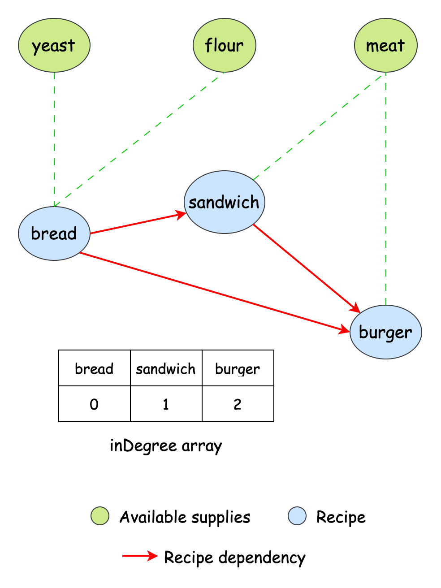

# 2115. Find All Possible Recipes from Given Supplies

You have information about `n` different recipes. You are given a string array recipes and a 2D string array `ingredients`. The `i_th` recipe has the name `recipes[i]`, and you can create it if you have all the needed ingredients from `ingredients[i]`. A recipe can also be an ingredient for other recipes, i.e., `ingredients[i]` may contain a string that is in recipes.

You are also given a string array supplies containing all the ingredients that you initially have, and you have an infinite supply of all of them.

Return a list of all the recipes that you can create. You may return the answer in any order.

Note that two recipes may contain each other in their ingredients.

**Example 1**:

**Input**: recipes = ["bread"], ingredients = [["yeast","flour"]], supplies = ["yeast","flour","corn"]

**Output**: ["bread"]
**Explanation**:

We can create "bread" since we have the ingredients "yeast" and "flour".

**Example 2**:

**Input**: recipes = ["bread","sandwich"], ingredients = [["yeast","flour"],["bread","meat"]], supplies = ["yeast","flour","meat"]

**Output**: ["bread","sandwich"]

**Explanation**:

We can create "bread" since we have the ingredients "yeast" and "flour".
We can create "sandwich" since we have the ingredient "meat" and can create the ingredient "bread".

**Example 3**:

**Input**: recipes = ["bread","sandwich","burger"], ingredients = [["yeast","flour"],["bread","meat"],["sandwich","meat","bread"]], supplies = ["yeast","flour","meat"]

**Output**: ["bread","sandwich","burger"]

**Explanation**:

We can create "bread" since we have the ingredients "yeast" and "flour".
We can create "sandwich" since we have the ingredient "meat" and can create the ingredient "bread".
We can create "burger" since we have the ingredient "meat" and can create the ingredients "bread" and "sandwich".

**Constraints**:

- `n == recipes.length == ingredients.length`
- `1 <= n <= 100`
- `1 <= ingredients[i].length, supplies.length <= 100`
- `1 <= recipes[i].length, ingredients[i][j].length, supplies[k].length <= 10`
- `recipes[i], ingredients[i][j]`, and `supplies[k]` consist only of lowercase English letters.
- All the values of `recipes` and `supplies` combined are unique.
- Each `ingredients[i]` does not contain any duplicate values.

# Solution

## Overview

Let's first try to equate our problem to a real-world cooking scenario. Imagine you have a kitchen stocked with basic ingredients and a cookbook filled with recipes. Each recipe specifies the exact ingredients needed to prepare it. Some recipes are simple, requiring only basic ingredients, while others are more complex, needing not just raw ingredients but also other prepared dishes as part of their recipe. Our goal is to determine which recipes can be made using the given set of available ingredients.

At first glance, this might seem straightforward. If we have all the ingredients listed for a recipe, we can make it. However, the problem becomes more complex when recipes depend on other recipes. Suppose Recipe A requires Recipe B, but Recipe B itself needs Recipe C, and Recipe C, in turn, depends on Recipe A. This creates a circular dependency, making it unclear where to begin. If we do not account for these dependencies properly, we could end up in an infinite loop, never determining which recipes can actually be made. Our approach needs to handle these interdependencies properly.

## Approach 1: Breadth-First Search (BFS)

### Intuition

One straightforward way to solve this problem is to make new recipes in rounds using our available ingredients. During each round, we check every recipe and ask, "Can we make this recipe with what we have?" If we can, we make it; if we can't, we'll try again later.

Let's break down how to write code for this approach. First, we need to track all our available ingredients. Since we'll frequently check if we have specific ingredients, we should use a data structure that allows quick lookups. A hash set is perfect for this because it lets us check and add ingredients almost instantly.

Next, we need a way to manage the recipes we want to attempt. We can use a queue to keep track of the recipes that we still need to process. Initially, the queue contains all the recipes since none have been prepared yet.

Now, we start processing the recipes. For each recipe in the queue, we check if all its required ingredients are available. If they are, we mark the recipe as completed and add it to our list of available ingredients, making it usable for other recipes. If we can't make a recipe yet, we put it back in the queue and try again in the next round.

But how do we know when to stop? Before each round, we note how many ingredients we have. If, after processing all recipes in the queue, the ingredient count has increased, it means we’ve made progress and should continue. However, if the ingredient count remains unchanged, it means no more recipes can be made, and we return the list of completed recipes.

Notice how this approach handles dependencies. If Recipe A depends on Recipe B, but we haven't made Recipe B yet, Recipe A remains in the queue. Later, once we successfully prepare Recipe B, Recipe A will have all the required ingredients and can be processed. This natural progression handles even complex dependency chains.

```python
class Solution:
    def findAllRecipes(
        self,
        recipes: list[str],
        ingredients: list[list[str]],
        supplies: list[str],
    ) -> list[str]:
        # Track available ingredients and recipes
        available = set(supplies)

        # Queue to process recipe indices
        recipe_queue = deque(range(len(recipes)))
        created_recipes = []
        last_size = -1  # Tracks last known available count

        # Continue while we keep finding new recipes
        while len(available) > last_size:
            last_size = len(available)
            queue_size = len(recipe_queue)

            # Process all recipes in current queue
            while queue_size > 0:
                queue_size -= 1
                recipe_idx = recipe_queue.popleft()
                if all(
                    ingredient in available
                    for ingredient in ingredients[recipe_idx]
                ):
                    # Recipe can be created - add to available items
                    available.add(recipes[recipe_idx])
                    created_recipes.append(recipes[recipe_idx])
                else:
                    recipe_queue.append(recipe_idx)

        return created_recipes
```

## Approach 2: Depth-First Search (DFS)

### Intuition

In our previous approach, we gathered as many recipes as we could make with the current set of ingredients in each iteration and then proceeded to find further recipes in the next iteration, mimicking a BFS approach. Let's try a different way.

Think about how you would actually make a recipe in real life. When you check your ingredients, you might find that one of them is actually another recipe you need to make first. Naturally, you'd pause your main recipe to figure out how to make this sub-recipe. This thought process matches perfectly with a depth-first search (DFS) solution.

Since our task is to find the number of recipes we can make from the given list, let's create a function checkRecipe which returns true if we can make the recipe. To check if we can, we go over the list of ingredients. Let's say we come across an ingredient that is itself another recipe. We can now use the checkRecipe function recursively to check if the recipe can be made, and then in turn, used as an ingredient to make the parent recipe.

However, there's a challenging aspect to this problem: circular dependencies. Here's a simple example:

Recipe A requires Recipe B to make it.
Recipe B requires Recipe C to make it.
Recipe C requires Recipe A to make it.
Without proper safeguards, our code could get stuck in an endless loop. To prevent this, we keep track of which recipes we're currently checking in a visited set. As we explore each recipe's dependencies, we mark it as visited. If we encounter a recipe that's already in our visited set, we know we've found a cycle and can immediately determine that the recipe isn't possible to make.

```python
class Solution:
    def findAllRecipes(
        self,
        recipes: list[str],
        ingredients: list[list[str]],
        supplies: list[str],
    ) -> list[str]:
        # Initialize tracking dictionaries using comprehensions
        can_make = dict.fromkeys(supplies, True)
        recipe_to_idx = {recipe: idx for idx, recipe in enumerate(recipes)}

        def _check_recipe(recipe: str, visited: set) -> bool:
            # Already processed and can be made
            if can_make.get(recipe, False):
                return True

            # Not a valid recipe or cycle detected
            if recipe not in recipe_to_idx or recipe in visited:
                return False

            visited.add(recipe)

            # Check if all ingredients can be made
            can_make[recipe] = all(
                _check_recipe(ingredient, visited)
                for ingredient in ingredients[recipe_to_idx[recipe]]
            )

            return can_make[recipe]

        # Process each recipe and collect those that can be made
        return [recipe for recipe in recipes if _check_recipe(recipe, set())]
```

## Approach 3: Topological Sort (Kahn's Algorithm)

### Intuition

Our previous solutions had some drawbacks. The BFS approach kept trying recipes repeatedly until we couldn't make any more, which could be slow when recipes had complex dependencies. While the DFS solution handled dependencies well, it needed careful tracking to avoid infinite loops. Let's explore a more organized approach using something called topological sorting.

Making recipes is really about the order we make them, since some recipes must be created before others. We can think of this like a map where arrows point from one recipe to another, showing what needs to be made first. Topological sorting is perfect for solving this kind of problem because it's designed to handle these "what comes first" relationships.

Instead of constantly checking which ingredients a recipe needs, we can reverse our perspective. Instead of focusing on what each recipe depends on, we track which recipes depend on a given ingredient. This shift in thinking allows us to process recipes in an optimal order i.e., whenever a new recipe is made, we immediately know which other recipes can now be completed.

The most important component of the topological sorting algorithm is the inDegree array. For each recipe, this array counts how many ingredients we still need to find. Here's what that means:

If a recipe has an in-degree of zero, it means all of its required ingredients are already available, and we can make it immediately.
Each time we complete a recipe, it becomes available as an ingredient for other recipes, so we decrease the in-degree of all recipes that depend on it.
When a recipe’s in-degree reaches zero, it becomes the next recipe we can make.
Here's how the inDegree array would look for Example 3 of the problem description:

indegree array



To implement the algorithm, we first create the dependency graph and populate the inDegree array. For each recipe, we iterate over its ingredients and add a directed edge from each ingredient to the recipe, but only if the ingredient is not already available in the initial supplies. This ensures that the in-degree of a recipe reflects only the number of unavailable ingredients it depends on.

Then, we iterate over each recipe using a queue and try to resolve the dependencies. Initially, we add to the queue all recipes that have an in-degree of zero, meaning they only require ingredients from our supplies and don't depend on any other recipes. As we complete each recipe, it becomes available as an ingredient for other recipes, so decrease the in-degree of all its dependent recipes by one. When all required ingredients for a recipe become available (its in-degree reaches zero), we can make that recipe too. It also becomes an ingredient by itself, so we add it to the queue.

We keep track of each recipe we make in a list called createdRecipes. When the queue is empty and all dependencies have been resolved, we return this list as our answer.

```python
class Solution:
    def findAllRecipes(
        self,
        recipes: list[str],
        ingredients: list[list[str]],
        supplies: list[str],
    ) -> list[str]:
        # Store available supplies
        available_supplies = set(supplies)
        # Map recipe to its index
        recipe_to_index = {recipe: idx for idx, recipe in enumerate(recipes)}
        # Map ingredient to recipes that need it
        dependency_graph = defaultdict(list)
        # Count of non-supply ingredients needed for each recipe
        in_degree = [0] * len(recipes)

        # Build dependency graph
        for recipe_idx, ingredient_list in enumerate(ingredients):
            for ingredient in ingredient_list:
                if ingredient not in available_supplies:
                    dependency_graph[ingredient].append(recipes[recipe_idx])
                    in_degree[recipe_idx] += 1

        # Start with recipes that only need supplies
        queue = deque(idx for idx, count in enumerate(in_degree) if count == 0)
        created_recipes = []

        # Process recipes in topological order
        while queue:
            recipe_idx = queue.popleft()
            recipe = recipes[recipe_idx]
            created_recipes.append(recipe)

            # Skip if no recipes depend on this one
            for dependent_recipe in dependency_graph[recipe]:
                in_degree[recipe_to_index[dependent_recipe]] -= 1
                if in_degree[recipe_to_index[dependent_recipe]] == 0:
                    queue.append(recipe_to_index[dependent_recipe])

        return created_recipes
```