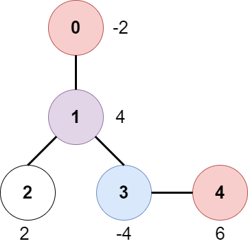

# 2467. Most Profitable Path in a Tree

There is an undirected tree with `n` nodes labeled from `0` to `n - 1`, rooted at node `0`. You are given a 2D integer array `edges` of length `n - 1` where `edges[i] = [ai, bi]` indicates that there is an edge between nodes $a_i$ and $b_i$ in the tree.

At every node `i`, there is a gate. You are also given an array of even integers amount, where `amount[i]` represents:

- the price needed to open the gate at node `i`, if `amount[i]` is negative, or,
- the cash reward obtained on opening the gate at node `i`, otherwise.

The game goes on as follows:

- Initially, Alice is at node `0` and Bob is at node `bob`.

- At every second, Alice and Bob each move to an adjacent node. Alice moves towards some leaf node, while Bob moves towards node `0`.

- For every node along their path, Alice and Bob either spend money to open the gate at that node, or accept the reward. Note that:
  - If the gate is already open, no price will be required, nor will there be any cash reward.
  - If Alice and Bob reach the node simultaneously, they share the price/reward for opening the gate there. In other words, if the price to open the gate is `c`, then both Alice and Bob pay `c / 2` each. Similarly, if the reward at the gate is `c`, both of them receive `c / 2` each.

- If Alice reaches a leaf node, she stops moving. Similarly, if Bob reaches node `0`, he stops moving. Note that these events are **independent** of each other.

Return the **maximum** net income Alice can have if she travels towards the optimal leaf node.

**Example 1**:



**Input**: edges = [[0,1],[1,2],[1,3],[3,4]], bob = 3, amount = [-2,4,2,-4,6]

**Output**: 6

**Explanation**: 

The above diagram represents the given tree. The game goes as follows:


- Alice is initially on node 0, Bob on node 3. They open the gates of their respective nodes.
  Alice's net income is now -2.
- Both Alice and Bob move to node 1. 
  Since they reach here simultaneously, they open the gate together and share the reward.
  Alice's net income becomes -2 + (4 / 2) = 0.
- Alice moves on to node 3. Since Bob already opened its gate, Alice's income remains unchanged.
  Bob moves on to node 0, and stops moving.
- Alice moves on to node 4 and opens the gate there. Her net income becomes 0 + 6 = 6.
Now, neither Alice nor Bob can make any further moves, and the game ends.
It is not possible for Alice to get a higher net income.

**Example 2**:

**Input**: edges = [[0,1]], bob = 1, amount = [-7280,2350]

**Output**: -7280

**Explanation**:
Alice follows the path 0->1 whereas Bob follows the path 1->0.
Thus, Alice opens the gate at node 0 only. Hence, her net income is -7280. 

**Constraints**:

- `2 <= n <= 105`
- `edges.length == n - 1`
- `edges[i].length == 2`
- `0 <= ai, bi < n`
- `ai != bi`
- `edges represents a valid tree.`
- `1 <= bob < n`
- `amount.length == n`
- `amount[i]` is an even integer in the range `[-10^4, 10^4]`.

# Solution

## Overview

We are given a tree with `n` nodes, where `n - 1` edges define its structure. The tree is rooted at node `0`. Additionally, we are provided with an array amount of size `n`, where each element represents the value of a node. All values in amount are even integers. Finally, we are given an integer `bob`, which indicates the starting node for Bob.

The two players Alice and Bob, traverse the tree simultaneously under the following conditions:

1. Alice starts at node `0` and moves towards a leaf node (a node with only one connection).
2. Bob starts at node `bob` and moves towards node `0` along the shortest path.

For each node visited, the income calculations follow these rules:

- If a player reaches a node first, they collect the full value of that node.
- If both players arrive at the same node at the same time, they split the value equally.
- If a node was previously visited by the other player, no income is collected.
- Our goal is to find the largest (maximum) income Alice can collect by choosing an optimal path toward a leaf node.

## Approach 1: Depth-First Search and Breadth-First Search

### Intuition

We need to find Bob’s path to node 0 and then find the best path Alice can take to maximize her collected amount. Since Bob only has one possible path to node 0 — the unique path from his starting position to the root — we can take advantage of this structure to track Bob’s travel time across each node.

To find Bob’s path, we use Depth-First Search (DFS). DFS is a natural choice because it fully explores each path before backtracking, allowing us to efficiently find the path Bob follows to the root. As we traverse, we record how long it takes Bob to reach each node along his path. Nodes not on this path are ignored since Bob never visits them.

Once Bob’s path is established, our next goal is to find Alice’s optimal path to a leaf node. Unlike Bob, Alice has multiple choices since a tree can have multiple leaves. This means we need an approach that considers all possible paths efficiently.

For this, we use Breadth-First Search (BFS). BFS systematically explores all nodes level by level, making it ideal for finding optimal paths. We start at the root node (0) and explore all adjacent nodes before moving deeper into the tree. This ensures that every possible path Alice can take is considered.

As Alice traverses, we use Bob’s path information to determine how much of the amount Alice can collect from each node. If Alice reaches a node before Bob, she takes the full amount. If Alice and Bob arrive at the same time, Alice only takes half. If Alice arrives after Bob, she gets nothing from that node.

Whenever Alice reaches a leaf node, we check her accumulated income along that path. If it is greater than the maximum recorded income, we update our maximum. By the end of the BFS traversal, we will have explored all valid paths for Alice and can return the highest income she can achieve.

```python
class Solution:
    def __init__(self):
        self.bob_path = {}
        self.visited = []
        self.tree = []

    def mostProfitablePath(self, edges, bob, amount):
        n = len(amount)
        max_income = float("-inf")
        self.tree = [[] for _ in range(n)]
        self.bob_path = {}
        self.visited = [False] * n
        node_queue = deque([(0, 0, 0)])

        # Form tree with edges
        for edge in edges:
            self.tree[edge[0]].append(edge[1])
            self.tree[edge[1]].append(edge[0])

        # Find the path taken by Bob to reach node 0 and the times it takes to get there
        self.find_bob_path(bob, 0)

        # Breadth First Search
        self.visited = [False] * n
        while node_queue:
            source_node, time, income = node_queue.popleft()

            # Alice reaches the node first
            if (
                source_node not in self.bob_path
                or time < self.bob_path[source_node]
            ):
                income += amount[source_node]
            # Alice and Bob reach the node at the same time
            elif time == self.bob_path[source_node]:
                income += amount[source_node] // 2

            # Update max value if current node is a new leaf
            if len(self.tree[source_node]) == 1 and source_node != 0:
                max_income = max(max_income, income)

            # Explore adjacent unvisited vertices
            for adjacent_node in self.tree[source_node]:
                if not self.visited[adjacent_node]:
                    node_queue.append((adjacent_node, time + 1, income))

            # Mark and remove current node
            self.visited[source_node] = True

        return max_income

    # Depth First Search
    def find_bob_path(self, source_node, time):
        # Mark and set time node is reached
        self.bob_path[source_node] = time
        self.visited[source_node] = True

        # Destination for Bob is found
        if source_node == 0:
            return True

        # Traverse through unvisited nodes
        for adjacent_node in self.tree[source_node]:
            if not self.visited[adjacent_node]:
                if self.find_bob_path(adjacent_node, time + 1):
                    return True

        # If node 0 isn't reached, remove current node from path
        self.bob_path.pop(source_node, None)
        return False
```

## Approach 2: Two Depth-First Searches

### Intuition

In the previous approach, we used BFS to explore all possible paths Alice could take. However, BFS requires maintaining a queue to track nodes at each level, which can introduce overhead when dealing with large trees. Each node needs to be added and removed from the queue multiple times, leading to additional memory usage.

To optimize this, we can replace BFS with DFS for Alice’s traversal. DFS naturally fits the problem because we can reuse the recursive call stack instead of an explicit queue, reducing memory overhead. This makes the approach more space-efficient while still ensuring that all paths are explored.

We start with a DFS traversal to find Bob’s path to node 0. This step remains unchanged from the previous approach. We record the time Bob takes to reach each node along his path. This information will be used later to determine how much Alice can collect from each node.

Once Bob’s path is identified, we initiate another DFS traversal for Alice. During this traversal, we recursively explore each path from node 0 to a leaf, keeping track of Alice’s time and accumulated income. At each node, we compare Alice’s arrival time with Bob’s recorded time:

If Alice arrives before Bob, she collects the full amount.
If Alice and Bob arrive at the same time, she collects half.
If Alice arrives after Bob, she collects nothing.
Since DFS explores one path at a time before backtracking, when Alice reaches a leaf node, we record her total collected income and compare it to the current maximum. We repeat this process until all paths are explored.

By the end of the traversal, we will have determined the largest income Alice can achieve and return this value as the result.

```python
class Solution:
    def __init__(self):
        self.bob_path = {}
        self.visited = []
        self.tree = []
        self.max_income = float("-inf")

    def mostProfitablePath(self, edges, bob, amount):
        n = len(amount)
        self.tree = [[] for _ in range(n)]
        self.bob_path = {}
        self.visited = [False] * n

        # Form tree with edges
        for edge in edges:
            self.tree[edge[0]].append(edge[1])
            self.tree[edge[1]].append(edge[0])

        # Find the path taken by Bob to reach node 0 and the times it takes to get there
        self.find_bob_path(bob, 0)

        # Find Alice's optimal path
        self.visited = [False] * n
        self.find_alice_path(0, 0, 0, amount)

        return self.max_income

    # Depth First Search to find Bob's path
    def find_bob_path(self, source_node, time):
        # Mark and set time node is reached
        self.bob_path[source_node] = time
        self.visited[source_node] = True

        # Destination for Bob is found
        if source_node == 0:
            return True

        # Traverse through unvisited nodes
        for adjacent_node in self.tree[source_node]:
            if not self.visited[adjacent_node] and self.find_bob_path(
                adjacent_node, time + 1
            ):
                return True

        # If node 0 isn't reached, remove current node from path
        self.bob_path.pop(source_node, None)
        return False

    # Depth First Search to find Alice's optimal path
    def find_alice_path(self, source_node, time, income, amount):
        # Mark node as explored
        self.visited[source_node] = True

        # Alice reaches the node first
        if (
            source_node not in self.bob_path
            or time < self.bob_path[source_node]
        ):
            income += amount[source_node]
        # Alice and Bob reach the node at the same time
        elif time == self.bob_path[source_node]:
            income += amount[source_node] // 2

        # Update max value if current node is a new leaf
        if len(self.tree[source_node]) == 1 and source_node != 0:
            self.max_income = max(self.max_income, income)

        # Traverse through unvisited nodes
        for adjacent_node in self.tree[source_node]:
            if not self.visited[adjacent_node]:
                self.find_alice_path(adjacent_node, time + 1, income, amount)
```

## Approach 3: Depth-First Search

### Intuition

The previous solution used two separate DFS traversals: one to determine Bob’s path and another to explore Alice’s optimal path. However, this causes redundancy, as each node may be visited twice. Instead, we can optimize the process by combining both tasks into a single DFS traversal, ensuring that we only explore each node once.

Our strategy is to use DFS to simultaneously track Bob’s path and compute Alice’s best possible income. Here, we first establish Bob’s travel time to each node. We initialize all node distances to n, a value greater than any possible travel time. As we traverse the tree, if a node is part of Bob’s path to 0, we update its distance to reflect how long it takes for Bob to reach it. Nodes not on Bob’s path retain their initial value, ensuring that they are always considered as being reached after Alice.

With Bob’s travel times recorded, we can now determine how much Alice collects from each node while recursively traversing the tree. As Alice moves, we compare her arrival time at each node to Bob’s recorded time. If she reaches a node before Bob, she collects the full amount. If she and Bob arrive at the same time, she gets half. If she arrives after Bob, she receives nothing. By structuring the traversal this way, Alice's maximum income is updated dynamically as she moves deeper into the tree. This ensures that we efficiently compute the highest possible income while keeping the traversal to just one DFS pass.

```python
class Solution:
    def __init__(self):
        self.tree = []
        self.distance_from_bob = []
        self.n = 0

    def mostProfitablePath(self, edges, bob, amount):
        self.n = len(amount)
        self.tree = [[] for _ in range(self.n)]
        self.distance_from_bob = [0] * self.n

        # Form tree with edges
        for edge in edges:
            self.tree[edge[0]].append(edge[1])
            self.tree[edge[1]].append(edge[0])

        return self.find_paths(0, 0, 0, bob, amount)

    # Depth-first Search
    def find_paths(self, source_node, parent_node, time, bob, amount):
        max_income = 0
        max_child = float("-inf")

        # Find the node distances from Bob
        if source_node == bob:
            self.distance_from_bob[source_node] = 0
        else:
            self.distance_from_bob[source_node] = self.n

        for adjacent_node in self.tree[source_node]:
            if adjacent_node != parent_node:
                max_child = max(
                    max_child,
                    self.find_paths(
                        adjacent_node, source_node, time + 1, bob, amount
                    ),
                )
                self.distance_from_bob[source_node] = min(
                    self.distance_from_bob[source_node],
                    self.distance_from_bob[adjacent_node] + 1,
                )

        # Alice reaches the node first
        if self.distance_from_bob[source_node] > time:
            max_income += amount[source_node]
        # Alice and Bob reach the node at the same time
        elif self.distance_from_bob[source_node] == time:
            max_income += amount[source_node] // 2

        # Return max income of leaf node
        return (
            max_income if max_child == float("-inf") else max_income + max_child
        )
```