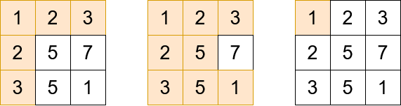

# 2503. Maximum Number of Points From Grid Queries

You are given an `m x n` integer matrix `grid` and an array `queries` of size `k`.

Find an array answer of size `k` such that for each integer `queries[i]` you start in the top left cell of the matrix and repeat the following process:

- If `queries[i]` is strictly greater than the value of the current cell that you are in, then you get one point if it is your first time visiting this cell, and you can move to any **adjacent** cell in all `4` directions: up, down, left, and right.

- Otherwise, you do not get any points, and you end this process.

After the process, `answer[i]` is the **maximum** number of points you can get. **Note** that for each query you are allowed to visit the same cell multiple times.

Return the resulting array `answer`.

**Example 1**:

**Input**: grid = [[1,2,3],[2,5,7],[3,5,1]], queries = [5,6,2]

**Output**: [5,8,1]

**Explanation**: The diagrams above show which cells we visit to get points for each query.

**Example 2**:

**Input**: grid = [[5,2,1],[1,1,2]], queries = [3]

**Output**: [0]

**Explanation**: We can not get any points because the value of the top left cell is already greater than or equal to 3.

**Constraints**:

- `m == grid.length`
- `n == grid[i].length`
- `2 <= m, n <= 1000`
- `4 <= m * n <= 10^5`
- `k == queries.length`
- `1 <= k <= 10^4`
- `1 <= grid[i][j], queries[i] <= 106`

# Solution

## Overview

We are given an `m x n` matrix `grid` and an array of queries, `queries`. For each query, we attempt to collect as many points as possible while following specific movement rules that dictate how far we can traverse the grid.

For each `queries[i]`, we begin at the top-left corner of the grid. We are allowed to move in four directions: up, down, left, and right. The primary condition governing movement is the comparison between `queries[i]` and the value of the current cell:

- If `queries[i]` is strictly greater than the value of the current cell, then:
  - If this is the first time visiting the cell, we earn one point.
  - We can then move to any of the adjacent cells (if they exist).

- If `queries[i]` is less than or equal to the value of the current cell, then:
  - We cannot proceed further from this cell.
  - The process for this query terminates immediately.

The final result for `queries[i]` is the number of unique cells we were able to collect points from.

Note: Each query starts independently, meaning that the traversal for one query does not affect the traversal for another.

Another difficult but extremely practical way to phrase this problem is to imagine you're at a buffet, where you can only eat dishes that are under a certain calorie count. Each dish represents a number in the grid, and your queries are your calorie limits. You want to know how many dishes you can indulge in without exceeding your limit. The algorithm helps you quickly determine how many dishes fit your criteria, allowing you to make the most of your buffet experience! Sometimes, the representation of data is more important than the data itself.

To solve this problem, we need a solid understanding of BFS, priority queues, and disjoint union. While we will explain the application of these concepts, we will not go in-depth into their theoretical aspects and their basic structure.