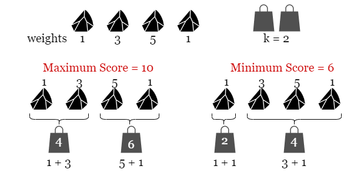
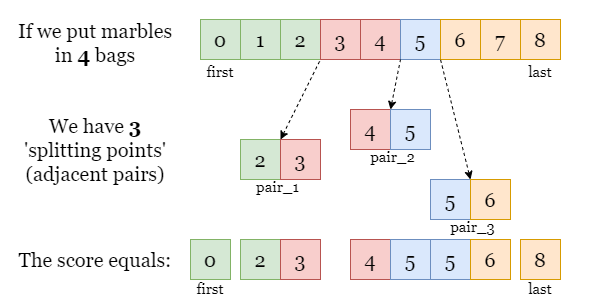
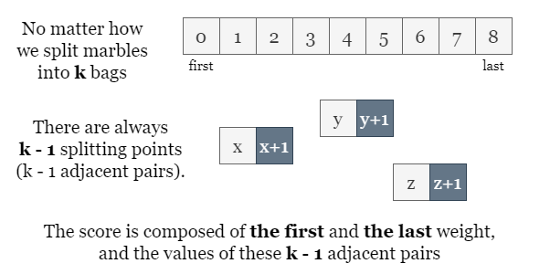
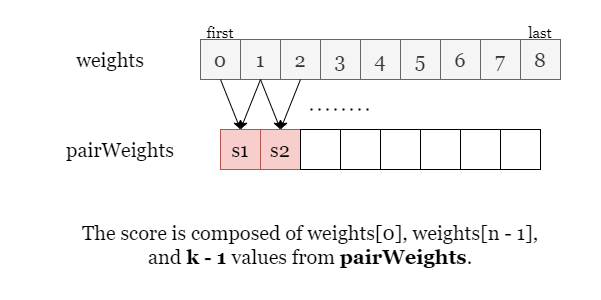

# 2551. Put Marbles in Bags

You have `k` bags. You are given a **0-indexed** integer array weights where `weights[i]` is the weight of the `i^th` marble. You are also given the integer `k`.

Divide the marbles into the `k` bags according to the following rules:

- No bag is empty.
- If the `i^th` marble and `j^th` marble are in a bag, then all marbles with an index between the `i^th` and `j^th` indices should also be in that same bag.
- If a bag consists of all the marbles with an index from `i` to `j` inclusively, then the cost of the bag is `weights[i]` + `weights[j]`.

The score after distributing the marbles is the sum of the costs of all the `k` bags.

Return the difference between the maximum and minimum scores among marble distributions.

**Example 1**:

**Input**: weights = [1,3,5,1], k = 2

**Output**: 4

**Explanation**:

The distribution [1],[3,5,1] results in the minimal score of (1+1) + (3+1) = 6. 
The distribution [1,3],[5,1], results in the maximal score of (1+3) + (5+1) = 10. 
Thus, we return their difference 10 - 6 = 4.

**Example 2**:

**Input**: weights = [1, 3], k = 2

**Output**: 0

**Explanation**: The only distribution possible is [1],[3]. 
Since both the maximal and minimal score are the same, we return 0.

**Constraints**:

- `1 <= k <= weights.length <= 10^5`
- `1 <= weights[i] <= 10^9`

# Solution

## Overview

As shown in the picture below, we put `4` marbles in `k = 2` bags.

There are several ways to split marbles into two bags, we have shown two of them that bring the maximum cost `10` and the minimum cost `6`. Therefore the difference between them is `10 - 6 = 4`.

## Approach: Sorting

### Intuition

Let's start with a brute-force approach. Since we are looking for the maximum score and the minimum score, we shall try iterating over all possible splits. Splitting `n` marbles into `k` consecutive groups is a typical sticks-and-stones problem that has as many as $\binom{n}{n} = \frac{n!}{k!(n-k)!}$ solutions, thus it is impractical to iterate over all possibilities.

We might also think of using dynamic programming to solve the subproblem `(x, y)`: splitting previous `x` marbles into `y` bags, then moving on to the next larger subproblem `(x + 1, y)` or `(x, y + 1)`, until we reach the best solution of the entire problem `(n, k)`. However, given the size of the input array and the maximum value of `k`, dynamic programming brings at most `O(n ** 2)` time thus it won't pass the time limit.

Let's shift our thinking a bit. Instead of focusing on how to partition the array of marbles, let's now focus on the boundary of each subarray, the splitting point and try to find the relation between the score and these splitting points.

In the picture below, we split the array into 4 subarrays (shown in different colors) and resulting in 3 splitting points, each of which is made of 2 adjacent ends.

**What is the score of this split?**

Since the score of a subarray only matters with its two ends, we can tell that the total score equals the sum of the first element, the last element, and the sum of every pair (two adjacent ends at each split).

In general, if we partition the array into `k` groups, we always make `k - 1` splitting points regardless of how the array is partitioned.

Now we know how to find the maximum score, by finding the sum of the largest `k - 1` pairs. Similarly, we can get the minimum score by finding the sum of the smallest `k - 1` pairs. This can be done by collecting every pair sum in an array pairWeights and sorting them.

MaxScore=weights[0]+weights[n−1] + $\sum_{i=n-k}^{k - 2}{pairWeights[i]}$ (if sorted the array pairWeights in non-decreasing order)

MinScore=weights[0]+weights[n−1]+ $\sum_{k-2}^{i=0}{pairWeights[i]}$ 

Then we have the difference between them as i

answer=MaxScore - MinScore =$\sum_{n-1}^{n-k}{pairWeights[i]} - \sum_{k-2}^{i=0}{pairWeights[i]}$
