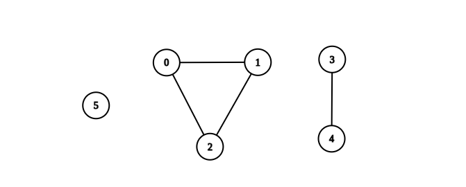

# 2685. Count the Number of Complete Components

You are given an integer `n`. There is an undirected graph with `n` vertices, numbered from `0` to `n - 1`. You are given a 2D integer array edges where `edges[i] = [a_i, b_i]` denotes that there exists an undirected edge connecting vertices `a_i` and `b_i`.

Return the number of complete connected components of the graph.

A connected component is a subgraph of a graph in which there exists a path between any two vertices, and no vertex of the subgraph shares an edge with a vertex outside of the subgraph.

A connected component is said to be complete if there exists an edge between every pair of its vertices.

**Example 1**:

**Input**: n = 6, edges = [[0,1],[0,2],[1,2],[3,4]]

**Output**: 3

**Explanation**:


From the picture above, one can see that all of the components of this graph are complete.

**Example 2**:

**Input**: n = 6, edges = [[0,1],[0,2],[1,2],[3,4],[3,5]]

**Output**: 1

**Explanation**:


The component containing vertices 0, 1, and 2 is complete since there is an edge between every pair of two vertices. On the other hand, the component containing vertices 3, 4, and 5 is not complete since there is no edge between vertices 4 and 5. Thus, the number of complete components in this graph is 1.

**Constraints**:

- `1 <= n <= 50`
- `0 <= edges.length <= n * (n - 1) / 2`
- `edges[i].length == 2`
- `0 <= ai, bi <= n - 1`
- `a_i != b_i`
- There are no repeated edges.

## Approach 4: Disjoint Set Union (Union-Find)

### Intuition

A complete connected component has a distinct property: it is a disjoint unit of the graph, meaning it does not share any connections with other parts of the graph. Our task is to identify these disjoint units and check whether their vertices and edges meet the criteria for completeness and connectivity.

One of the most effective ways to find separate groups in a graph is by using the Union-Find algorithm (also known as Disjoint Set Union). This method helps group vertices that belong together. Each group has a representative vertex, known as the leader, which serves as the group's identifier. To determine whether two vertices belong to the same group, we simply check if they share the same leader.

In our Union-Find implementation, we also track the size of each component. Maintaining size is not only useful for optimizing the merging of components - since attaching a smaller component to a larger one is more efficient - but also plays a crucial role in this problem: it tells us exactly how many vertices exist in each component. To verify whether a component is a valid complete connected component, we check if its edge count matches  
2
k⋅(k−1)
​
 , where k is the number of vertices in the component.

Now, let’s implement our solution. First, we initialize a Union-Find structure and perform the "union" operation for each edge in our input. Since an edge signifies that two vertices belong to the same component, applying "union" to all edges ensures that all vertices are grouped correctly.

Next, we count the number of edges in each component. To do this, we use a hash map that associates each component with its edge count. Since Union-Find assigns each component a unique representative (the root of its tree), we use these representatives as keys in the map.

Finally, we iterate through each group leader and check if the group forms a complete component. A group is complete if its edge count equals  
2
k⋅(k−1)
​
 . If it does, we increment our final count. Once all components have been processed, we return the total number of complete components as our answer.

```python
class UnionFind:
    def __init__(self, n):
        self.parent = [-1] * n
        self.size = [1] * n

    def _find(self, node):
        # Find root of component with path compression
        if self.parent[node] == -1:
            return node
        self.parent[node] = self._find(self.parent[node])
        return self.parent[node]

    def _union(self, node_1, node_2):
        # Union by size
        root_1 = self._find(node_1)
        root_2 = self._find(node_2)

        if root_1 == root_2:
            return

        # Merge smaller component into larger one
        if self.size[root_1] > self.size[root_2]:
            self.parent[root_2] = root_1
            self.size[root_1] += self.size[root_2]
        else:
            self.parent[root_1] = root_2
            self.size[root_2] += self.size[root_1]


class Solution:
    def countCompleteComponents(self, n: int, edges: List[List[int]]) -> int:
        # Initialize Union Find and edge counter
        dsu = UnionFind(n)
        edge_count = {}

        # Connect components using edges
        for edge in edges:
            dsu._union(edge[0], edge[1])

        # Count edges in each component
        for edge in edges:
            root = dsu._find(edge[0])
            edge_count[root] = edge_count.get(root, 0) + 1

        # Check if each component is complete
        complete_count = 0
        for vertex in range(n):
            if dsu._find(vertex) == vertex:  # If vertex is root
                node_count = dsu.size[vertex]
                expected_edges = (node_count * (node_count - 1)) // 2
                if edge_count.get(vertex, 0) == expected_edges:
                    complete_count += 1

        return complete_count
```
