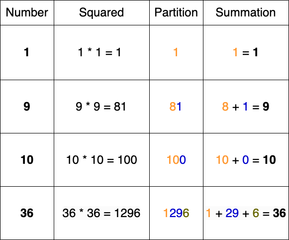

<!-- @leetcode -->

# 2698. Find the Punishment Number of an Integer

Given a positive integer `n`, return the **punishment number** of `n`.

The punishment number of `n` is defined as **the sum of the squares of all integers i** such that:

- `1 <= i <= n`
- The decimal representation of `i * i` can be partitioned into contiguous substrings such that the sum of the integer values of these substrings equals `i`.

**Example 1**:

**Input**: n = 10
**Output**: 182
**Explanation**: There are exactly 3 integers i in the range [1, 10] that satisfy the conditions in the statement:

- 1 since 1 * 1 = 1
- 9 since 9 * 9 = 81 and 81 can be partitioned into 8 and 1 with a sum equal to 8 + 1 == 9.
- 10 since 10 * 10 = 100 and 100 can be partitioned into 10 and 0 with a sum equal to 10 + 0 == 10.
Hence, the punishment number of 10 is 1 + 81 + 100 = 182

**Example 2**:

**Input**: n = 37
**Output**: 1478
**Explanation**: There are exactly 4 integers i in the range [1, 37] that satisfy the conditions in the statement:

- 1 since 1 * 1 = 1.
- 9 since 9 * 9 = 81 and 81 can be partitioned into 8 + 1.
- 10 since 10 * 10 = 100 and 100 can be partitioned into 10 + 0.
- 36 since 36 * 36 = 1296 and 1296 can be partitioned into 1 + 29 + 6.
Hence, the punishment number of 37 is 1 + 81 + 100 + 1296 = 1478

**Constraints**:

- `1 <= n <= 1000`

# Solution

---

## Overview

We are given a positive integer `n`, and our task is to return its **punishment number**.

The **punishment number** is the sum of the squares of all integers i that satisfy two conditions:

- Range: `i` must be within the range `1 <= i <= n`.
- Partition: The decimal representation of `i * i` can be partitioned into contiguous substrings such that the sum of these substrings equals `i`.

In other words, for each integer in the range `[1, n]`, we check whether the digits of its squared value can be split so that the resulting sum matches the original number.

Let's look at examples where the squared integer's digits can be partitioned as described: 

As we can see, multiple ways exist to split the digits of a squared integer, leading to different summations. Our goal is to find at least one valid partition for each integer in the given range and sum up the squares of all numbers that satisfy the condition.

## Approach 1: Memoization

### Intuition

We need to find whether a number’s square can be split into contiguous substrings that add to the original number. If such a partition exists, we add the square to the final punishment sum. To break this down, we need to establish the core relationship: for each number `currentNum` in the range `[1, n]`, we compute its square (say `squareNum`) and check whether we can split its digits in a way that the sum of those partitions equals `currentNum`. The challenge is to explore all possible ways to partition the number while ensuring we do not perform unnecessary computations.

A brute-force approach would involve generating every possible partition of `squareNum`, computing the sum for each partition, and checking if it equals `currentNum`. However, this results in exponential complexity since the number of ways to split a string grows exponentially with its length. Instead, we adopt a **recursive backtracking** approach where we attempt to build valid partitions step by step.

The key observation is that at any given position in the string representation of `squareNum`, we can take a substring of any length starting from that position, convert it into an integer, and add it to a running sum (sum). If at any point sum exceeds `currentNum`, we stop exploring that branch early. If we reach the end of the string and sum equals `currentNum`, we confirm that a valid partition exists. This naturally leads to a recursive function that explores different partitioning options.

However, recursion alone would lead to redundant calculations. If we repeatedly attempt to partition the same substring from the same index with the same accumulated sum, we are performing unnecessary recomputation. This is where **dynamic programming (DP)** with memoization helps. We use a 2D array `memo[startIndex][sum]` to store the results of previously computed states. Here, `startIndex` represents our current position in the string, and `sum` represents the accumulated sum of selected partitions. If a state has already been computed, we can return the stored result immediately, avoiding redundant calculations.

With this strategy in mind, we iterate through numbers from `1` to `n`, square each number, and check if it can be partitioned using the recursive function `findPartitions()`. Before each call, we reset the DP array to ensure we do not mix results across different numbers. Then, our recursive function attempts to extract substrings, add them to the sum, and continue exploring further partitions. If a valid partition is found, we add squareNum to our total punishment sum.

### Algorithm

1. Initialize an integer `punishmentNum`, which represents the punishment number of the range `[1, n]`.
2. Create the `findPartitions()` function, which takes integers `startIndex`, `sum`, and `target`, a string `stringNum`, and a 2D array `memo` as parameters and returns a boolean value.

- If we reach the end of the string, return `true` if the sum of the current partition equals target.
- If the sum is greater than target, return `false`, indicating that the current permutation does not add up to target.
- If `memo[startIndex][sum]` is not `-1`, return the stored result since it has already been computed.
- Initialize a boolean value, `partitionFound`, to `false`.
- Iterate through the digits from indices `startIndex` up to the size of `stringNum`. For each index, `currIndex`:
  - Get the substring of `stringNum` starting to the right of `currentIndex`.
  - Recursively call `findPartitions()` to check if the summation of the current partition added to the current sum equals target.
  - If any valid partition is found, return `true`.
  - Memoize the result for future reference and return the result.

3. Iterate through the integers from index `0` to `n`:

- For each number, `currentNum`, calculate the squared value of `currentNum` and store it as `squareNum`.
- Create a 2D array, `memoArray` to store all the partitions of `squareNum`, and initialize all of its values to `-1`.
- Input `0`, `0`, the string version of `squareNum`, `currentNum`, and `memoArray` into the function `findPartitions()` as the `startIndex`, `sum`, `stringNum`, `target`, and `memo` parameters, respectively.
- If `findPartitions()` returns `true`, add `currentNum` to `punishmentNum`.

4. After all the iterations are completed, return `punishmentNum`.

```python
class Solution:
    def find_partitions(
        self, start_index, current_sum, string_num, target, memo
    ):
        # Check if partition is valid
        if start_index == len(string_num):
            return current_sum == target

        # Invalid partition found, so we return False
        if current_sum > target:
            return False

        # If the result for this state is already calculated, return it
        if memo[start_index][current_sum] != -1:
            return memo[start_index][current_sum] == 1

        partition_found = False

        # Iterate through all possible substrings starting with start_index
        for current_index in range(start_index, len(string_num)):
            # Create partition
            current_string = string_num[start_index : current_index + 1]
            addend = int(current_string)

            # Recursively check if valid partition can be found
            partition_found = partition_found or self.find_partitions(
                current_index + 1,
                current_sum + addend,
                string_num,
                target,
                memo,
            )
            if partition_found:
                memo[start_index][current_sum] = 1
                return True

        # Memoize the result for future reference and return its result
        memo[start_index][current_sum] = 0
        return False

    def punishmentNumber(self, n: int) -> int:
        punishment_num = 0
        # Iterate through numbers in range [1, n]
        for current_num in range(1, n + 1):
            square_num = current_num * current_num
            string_num = str(square_num)

            # Initialize values in memoization array
            memo_array = [
                [-1] * (current_num + 1) for _ in range(len(string_num))
            ]

            # Check if valid partition can be found and add squared number if so
            if self.find_partitions(0, 0, string_num, current_num, memo_array):
                punishment_num += square_num

        return punishment_num
```

## Approach 2: Recursion of Strings

### Intuition

The primary source of memory usage in the previous solution is the memo array, which stores the results of all possible partitions. This array consumes significant space, but we only need to determine whether a valid partition exists for each number. This eliminates the need to track every potential partition for future reference, making it unnecessary to store intermediate results. Thus, we can reduce the overall space complexity by removing the dependency on the memo array.

With this realization, we can refactor the solution to rely entirely on backtracking. We traverse all possible substrings and attempt to add them to see if we can match the original number. As soon as we find a valid partition, we return true and stop further exploration.

The rest of the solution follows the same logic as the memoization approach: for each number in the range `[1, n]`, we compute its square and check if any partition of the square sums up to the number itself. If we find a valid partition, we add the square to the punishment number.

### Algorithm

1. Initialize an integer `punishmentNum`, which represents the punishment number of the range `[1, num]`.

2. Create the function `canPartition()`, which takes a string `stringNum` and an integer `target` parameter and returns a boolean value.

   - If the string is empty and the `target` equals `0`, return `true`, indicating that a valid partition that adds up to the `target` was found.
   - If the `target` is less than `0`, return `false`, indicating that the current partition is invalid.
   - Iterate through the string `stringNum`. For each index index:
     - Let string `left` represent the substring up to index, and `right` represent the remainder of the string.
     - Recursively call `canPartition()` with `right` as `stringNum` and the difference between `target` and theinteger version of `left` as `target`.

   - If any recursive branch of `canPartition()` returns `true`, else return `false`.

3. Iterate through the integers from index 0 to num:
   - For each number, `currentNum`, calculate the squared value of `currentNum` and store it as `squareNum`.
   - Input the string version of `currentNum`, and `squareNum` into the function `canPartition()` as the `num` and `target` parameters, respectively.
   - If `canPartition()` returns `true`, add `currentNum` to `punishmentNum`.

4. After all the iterations are completed, return `punishmentNum`.

```python
class Solution:
    def can_partition(self, string_num, target):
        # Valid Partition Found
        if not string_num and target == 0:
            return True

        # Invalid Partition Found
        if target < 0:
            return False

        # Recursively check all partitions for a valid partition
        for index in range(len(string_num)):
            left = string_num[: index + 1]
            right = string_num[index + 1 :]
            left_num = int(left)

            if self.can_partition(right, target - left_num):
                return True

        return False

    def punishmentNumber(self, n: int) -> int:
        punishment_num = 0

        # Iterate through numbers in range [1, n]
        for current_num in range(1, n + 1):
            square_num = current_num * current_num

            # Check if valid partition can be found and add squared number if so
            if self.can_partition(str(square_num), current_num):
                punishment_num += square_num

        return punishment_num
```

## Approach 3: Recursion of Integers

### Intuition

In the previous approaches, we used string manipulation to get the answer. Now, instead of treating the problem as a sequence of string-based substrings, we can focus on partitioning the digits of a number using integer operations. This allows us to avoid the overhead of converting numbers to strings and directly work with the numeric properties of the number.

We can use the **modulo** and **division** operations to extract different parts of a number. These operations let us break the number down into individual digits or groups of digits, which we can then use to test if their sum matches the target value.

To understand this better, let's consider an example: the number `634`. Using the **modulo** operation, we can extract the digits or groups of digits as follows:

`634 % 10 = 4` (extracts the last digit)

`634 % 100 = 34` (extracts the last two digits)

`634 % 1000 = 634` (extracts the entire number)

Now, using the division operation, we can continually reduce the number by removing its rightmost digits:

`634 / 10 = 63` (removes the last digit)

`634 / 100 = 6` (removes the last two digits)

`634 / 1000 = 0` (number is fully reduced)

By performing these operations, we can generate permutations of the number from the rightmost side. This is a key observation: we start from the rightmost digits, using the modulo operation to extract the current part of the number and division to reduce the number progressively. When partitioning the number into its components, we want to break it down from the least significant digit (the rightmost side) to the most significant one.

More specifically, when processing from the right, we are naturally ensuring that smaller partitions (from right to left) are handled first. For instance, `634` can be partitioned as: `4`, `34`, and `634`. If we try to partition from left to right, we're forced to consider all permutations of the number starting with the largest unit (which can quickly escalate into complex cases).

### Algorithm

1. Initialize an integer `punishmentNum`, which represents the punishment number of the range `[1, num]`.

2. Create the function `canPartition()`, which takes integer parameters `num` and `target` and returns a boolean value.

   - If `target` is less than `0` or `num` is less than `target`, return `false`, indicating that the current partition of `num` does not add up to `target`.
   - If `num` equals `target`, return `true`, indicating that the current partition of `num` adds up to `target`.
   - Otherwise, recursively check the digit combinations starting from the right side of the number to find any that make the summation equal to `target`, returning `true` if any are found.
     - Check each possible combination of digits, removing them from `num` and subtracting them from `target`.
     - Since target is bound by the constraint 1 <= num <= 1000, we only have to check multiples of 10s, 100s, and 1000s.

3. Iterate through the integers from index `0` to `num`:
    - For each number, `currentNum`, calculate the squared value of `currentNum` and store it as `squareNum`.
    - Input the `currentNum` and `squareNum` into the function `canPartition()` as the `num` and `target` parameters, respectively.
    - If `canPartition()` returns true, add `currentNum` to `punishmentNum`.

4. After all the iterations are completed, return `punishmentNum`.

```python
class Solution:
    def can_partition(self, num, target):
        # Invalid partition found
        if target < 0 or num < target:
            return False

        # Valid partition found
        if num == target:
            return True

        # Recursively check all partitions for a valid partition
        return (
            self.can_partition(num // 10, target - num % 10)
            or self.can_partition(num // 100, target - num % 100)
            or self.can_partition(num // 1000, target - num % 1000)
        )

    def punishmentNumber(self, n: int) -> int:
        punishment_num = 0

        # Iterate through numbers in range [1, n]
        for current_num in range(1, n + 1):
            square_num = current_num * current_num

            # Check if valid partition can be found and add squared number if so
            if self.can_partition(square_num, current_num):
                punishment_num += square_num

        return punishment_num
```
