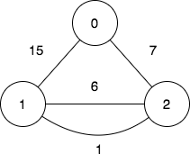

# 3108. Minimum Cost Walk in Weighted Graph

There is an undirected weighted graph with `n` vertices labeled from `0` to `n - 1`.

You are given the integer `n` and an array edges, where `edges[i]` = `[u_i, v_i, w_i]` indicates that there is an edge between vertices `u_i` and `v_i` with a weight of `w_i`.

A walk on a graph is a sequence of vertices and edges. The walk starts and ends with a vertex, and each edge connects the vertex that comes before it and the vertex that comes after it. It's important to note that a walk may visit the same edge or vertex more than once.

The cost of a walk starting at node `u` and ending at node `v` is defined as the bitwise AND of the weights of the edges traversed during the walk. In other words, if the sequence of edge weights encountered during the walk is `w_0`, `w_1`, `w_2`, ..., `w_k`, then the cost is calculated as `w_0 & w_1 & w_2 & ... & w_k`, where `&` denotes the bitwise AND operator.

You are also given a 2D array query, where `query[i] = [s_i, t_i]`. For each query, you need to find the minimum cost of the walk starting at vertex `s_i` and ending at vertex `t_i`. If there exists no such walk, the answer is `-1`.

Return the array `answer`, where `answer[i]` denotes the minimum cost of a walk for query `i`.

**Example 1**:

**Input**: n = 5, edges = [[0,1,7],[1,3,7],[1,2,1]], query = [[0,3],[3,4]]

**Output**: [1,-1]

**Explanation**:

To achieve the cost of 1 in the first query, we need to move on the following edges: 0->1 (weight 7), 1->2 (weight 1), 2->1 (weight 1), 1->3 (weight 7).

In the second query, there is no walk between nodes 3 and 4, so the answer is -1.

**Example 2**:

**Input**: n = 3, edges = [[0,2,7],[0,1,15],[1,2,6],[1,2,1]], query = [[1,2]]

**Output**: [0]

**Explanation**:

To achieve the cost of 0 in the first query, we need to move on the following edges: 1->2 (weight 1), 2->1 (weight 6), 1->2 (weight 1).

**Constraints**:

- `2 <= n <= 10^5`
- `0 <= edges.length <= 10^5`
- `edges[i].length == 3`
- `0 <= u_i, v_i <= n - 1`
- `u_i != v_i`
- `0 <= w_i <= 105`
- `1 <= query.length <= 10^5`
- `query[i].length == 2`
- `0 <= s_i, t_i <= n - 1`
- `s_i != t_i`

# Solution

## Overview

We are given an undirected weighted graph, represented by an array edges, where edges[i] = [u, v, w] indicates an edge between vertices u and v with weight w. Additionally, we are given an array queries, where queries[i] = [s, t] represents a pair of nodes in the graph.

For each query, our task is to determine the minimum cost of a walk that starts at node s and ends at node t. If no such walk exists, the answer is -1. Let's first define the two key terms involved in this task:

A walk in a graph is a sequence of connected vertices and the edges that connect them. Unlike a path, a walk allows both edges and vertices to be repeated.
The cost of a walk is defined as the bitwise AND of the weights of all edges encountered in the walk.
First, recall that the bitwise AND operation compares the bits of all the numbers involved and keeps a bit as 1 only if it is 1 in every number; otherwise, the bit becomes 0. Now, consider the smallest number in the group. It already has some bits set to 0. Since the AND operation can only turn bits off (changing 1 to 0, but never 0 to 1), the result can never have more 1s than the smallest number. This means the result is always less than or equal to the smallest number.

In this problem, that tells us that adding more edges to a walk can only keep the cost the same or make it smaller. So, to find the minimum cost, we should try to include as many edges as possible in the walk.

Notice that since w AND w = w, revisiting the same edge multiple times does not change the total cost. This can be useful if we need to backtrack to take a different path, in order to visit more edges.

## Approach 1: Disjoint-Set (Union-Find)

### Intuition

First, let's determine when the answer to a query is -1. This happens when no walk exists between the two nodes, meaning they belong to different connected components.

A connected component in an undirected graph is a group of nodes where there is a path between any pair of nodes.

Now, suppose the two nodes belong to the same connected component. What is the minimum cost of a walk connecting them? As mentioned, the optimal walk includes as many edges as possible. Since revisiting an edge does not affect the total score, we can freely traverse the edges of the component, meaning that we can move back and forth to reach all of them. Therefore, the best way to achieve the lowest cost is to visit every edge in the component.

To efficiently find and process the connected components of the graph, we use the Disjoint Set (Union-Find) data structure. This approach relies on two main operations: Union and Find. Each connected component has a representative node, known as its root, which is returned by the Find operation for any node in the group. When we Union two nodes, we merge their entire groups, as now a path exists between every node in one group and every node in the other. To maintain efficiency, the root of the larger group is chosen as the representative of the merged group. This minimizes the time needed for future Find operations by reducing the number of steps required to reach the current representative.

> Disjoint Set (Union-Find): For a more comprehensive understanding of the Disjoint Set data structure, check out the Disjoint Set/Union-Find Explore Card. This resource provides an in-depth look at Union-Find, explaining its key concepts and applications with a variety of problems to solidify understanding of the pattern.

Once the nodes are grouped into connected components, we calculate the total cost for each component as the bitwise AND of all its edge weights. In the end, the minimum cost of a walk between any two nodes in the same component will be the same and equal to the component's total cost.