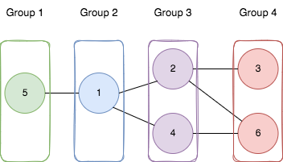

<!-- @leetcode -->

# Divide Nodes Into the Maximum Number of Groups

You are given a positive integer `n` representing the number of nodes in an **undirected graph**. The nodes are labeled from `1` to `n`.

You are also given a 2D integer array edges, where `edges[i] = [ai, bi]` indicates that there is a **bidirectional** edge between nodes `ai` and `bi`. Notice that the given **graph may be disconnected**.

Divide the nodes of the graph into `m` groups (`1-indexed`) such that:

- Each node in the graph belongs to exactly one group.
- For every pair of nodes in the graph that are connected by an edge `[ai, bi]`, if `ai` belongs to the group with index `x`, and `bi` belongs to the group with index `y`, then `|y - x| = 1`.

Return the maximum number of groups (i.e., maximum `m`) into which you can divide the nodes. Return `-1` if it is impossible to group the nodes with the given conditions.

**Example 1:**



**Input**: n = 6, edges = [[1,2],[1,4],[1,5],[2,6],[2,3],[4,6]]

**Output**: 4

Explanation: As shown in the image we:

- Add node 5 to the first group.
- Add node 1 to the second group.
- Add nodes 2 and 4 to the third group.
- Add nodes 3 and 6 to the fourth group.

We can see that every edge is satisfied.

It can be shown that that if we create a fifth group and move any node from the third or fourth group to it, at least on of the edges will not be satisfied.

**Example 2:**

**Input**: n = 3, edges = [[1,2],[2,3],[3,1]]

**Output**: -1

**Explanation**: If we add node 1 to the first group, node 2 to the second group, and node 3 to the third group to satisfy the first two edges, we can see that the third edge will not be satisfied.

It can be shown that no grouping is possible.

**Constraints:**

- `1 <= n <= 500`
- `1 <= edges.length <= 104`
- `edges[i].length == 2`
- `1 <= ai, bi <= n`
- `ai != bi`
- There is at most one edge between any pair of vertices.

# Solution

## Overview

We are given a graph with `n` nodes, represented by a 2D array edges, where `edges[i] = [u, v]` means there is a **bidirectional** edge between nodes `u` and `v`. Our task is to divide the nodes into the largest number of numbered groups (1, 2, 3, ...) such that:

- Each node belongs to exactly one group.
- If there is an edge `[u, v]`, and `u` is in group `x`, then `v` must be in either group `x - 1` or `x + 1`.

Sometimes, this kind of split is not possible. For example, consider this graph: 

Here, no valid split exists. In such cases, we return `-1`.

A key observation is that if it’s possible to divide the nodes into `x` groups (`x > 2`), we can also divide them into `x - 1` groups. Intuitively, this works because the nodes in the first and third groups can’t be directly connected, but they must all connect to nodes in the second group. By combining groups 1 and 3, we get a valid split with `x - 1` groups. 

So, to check if a valid split is possible, we just need to see if the graph can be split into two groups—in other words, whether it is *bipartite*.

> **Note**: A graph is bipartite when we can divide its nodes into two distinct sets where:
>
> - All edges connect vertices from one set to vertices in the other set.
> - No edges exist between vertices within the same set.

Another key detail to consider is that the given graph is not always connected. In this case, we calculate the largest number of groups for each connected part of the graph, and then take the sum of these numbers.

To sum up, the problem boils down to these two steps:

1. Check if the graph is bipartite to see if a valid split exists.
2. For each connected part of the graph, find the largest number of groups we can divide the nodes into and return their sum.

## Approach 1: Graph Coloring + Longest Shortest Path (Optimal)

### Intuition

To solve the first part of the problem, note that once we assign a single node to one of the two groups, the rest of the assignments are automatically determined. Nodes directly connected to the first node must go in the second group, their neighbors must return to the first group, and so on.

To check if the graph is bipartite, we "color" the nodes using two colors (one for each group), ensuring that any two connected nodes have different colors. If this coloring fails, the graph is not bipartite, and we can immediately return `-1`. 

If the graph is bipartite, we calculate the maximum number of groups we can divide the nodes into for each connected component separately. Intuitively, to achieve the largest number of groups, we spread the nodes as far apart as possible. This means that instead of simply assigning a neighboring node to the same group as the one it was previously associated with, we always try to assign it to a new group.

An important observation here is that the maximum number of groups in a component is determined by the longest shortest path between any pair of nodes in that component. This is similar to finding the "height" of the component if it were structured like a tree, with different nodes as potential roots. The longest shortest path essentially tells us how many layers or groups can be created based on the distances between the nodes.

Finally, we repeat this for all connected components in the graph and sum up the results to get the answer.

### Algorithm

isBipartite(adjList, node, colors) function
Iterate over the neighbors of node and attempt to assign them the opposite color of node:
If neighbor already has the same color as node (i.e., colors[neighbor] == colors[node]), return false.
If neighbor has already been assigned a color (i.e., colors[neighbor] != -1), skip to the next neighbor.
Assign colors[neighbor] = (colors[node] + 1) % 2.
Recursively call isBipartite(adjList, neighbor, colors) and return false if the call returns false.
If all neighbors are successfully assigned the opposite color without conflicts, return true.
getLongestShortestPath(adjList, srcNode, n) function
Initialize a queue, nodesQueue and a visited array of size n.
PushsrcNode into the queue and mark it as visited.
Initialize distance to 0.
While the nodesQueue is not empty:
Initialize numOfNodesInLayer to the size of the queue.
Process all nodes in the current layer, i.e. for i from 0 to numOfNodesInLayer - 1:
Pop out the first element from the queue as currentNode.
For each neighbor of currentNode:
If the neighbor is visited, skip it.
Otherwise, mark it as visited and push it into the nodesQueue.
Increment distance by 1.
Return distance.
getNumberOfGroupsForComponent(adjList, node, distances, visited) function
Initialize maxNumberOfGroups to distances[node].
Mark the current node as visited.
Explore the rest of the nodes in the component, i.e. for each neighbor of node:
If the neighbor is visited, skip it.
Otherwise, set maxNumberOfGroups to the maximum of its current value and getNumberOfComponentsInGroup(adjList, neighbor, distances, visited).
Return maxNumberOfGroups.
In the main magnificentSets(n, edges) function:
Create the adjList of the graph.
Create a colors array of size n with all elements initially set to -1.
For each node of the graph:
If the node have not been assigned a color, i.e. (colors[node] == -1):
Fix the color of the first node of the component, i.e. set colors[node] = 0.
Call isBipartite(adjList, node, colors) to determine if the current component is bipartite. If not, return -1.
Initialize an array distances to store the length of the longest shortest path from any node to any other.
Fill the distances array using the getLongestShortestPath function.
Initialize maxNumberOfGroups to 0 and a visited array with all elements set to false.
For each node of the graph:
If node has not been visited:
Get the number of groups for its component and add it to the total number of groups, i.e. maxNumberOfGroups += getNumberOfGroupsForComponent(adjList, node, distances, visited).
Return maxNumberOfGroups.

```python
class Solution:

    # Main function to calculate the maximum number of magnificent sets
    def magnificentSets(self, n, edges):
        # Create adjacency list for the graph
        adj_list = [[] for _ in range(n)]
        for edge in edges:
            # Transition to 0-index
            adj_list[edge[0] - 1].append(edge[1] - 1)
            adj_list[edge[1] - 1].append(edge[0] - 1)

        # Initialize color array to -1
        colors = [-1] * n

        # Check if the graph is bipartite
        for node in range(n):
            if colors[node] != -1:
                continue
            # Start coloring from uncolored nodes
            colors[node] = 0
            if not self._is_bipartite(adj_list, node, colors):
                return -1

        # Calculate the longest shortest path for each node
        distances = [
            self._get_longest_shortest_path(adj_list, node, n)
            for node in range(n)
        ]

        # Calculate the total maximum number of groups across all components
        max_number_of_groups = 0
        visited = [False] * n
        for node in range(n):
            if visited[node]:
                continue
            # Add the number of groups for this component to the total
            max_number_of_groups += self._get_number_of_groups_for_component(
                adj_list, node, distances, visited
            )

        return max_number_of_groups

    # Checks if the graph is bipartite starting from the given node
    def _is_bipartite(self, adj_list, node, colors):
        for neighbor in adj_list[node]:
            # If a neighbor has the same color as the current node, the graph is not bipartite
            if colors[neighbor] == colors[node]:
                return False
            # If the neighbor is already colored, skip it
            if colors[neighbor] != -1:
                continue
            # Assign the opposite color to the neighbor
            colors[neighbor] = (colors[node] + 1) % 2
            # Recursively check bipartiteness for the neighbor; return false if it fails
            if not self._is_bipartite(adj_list, neighbor, colors):
                return False
        # If all neighbors are properly colored, return true
        return True

    # Computes the longest shortest path (height) in the graph starting from the source node
    def _get_longest_shortest_path(self, adj_list, src_node, n):
        # Initialize a queue for BFS and a visited array
        nodes_queue = deque([src_node])
        visited = [False] * n
        visited[src_node] = True
        distance = 0

        # Perform BFS layer by layer
        while nodes_queue:
            # Process all nodes in the current layer
            for _ in range(len(nodes_queue)):
                current_node = nodes_queue.popleft()
                # Visit all unvisited neighbors of the current node
                for neighbor in adj_list[current_node]:
                    if visited[neighbor]:
                        continue
                    visited[neighbor] = True
                    nodes_queue.append(neighbor)
            # Increment the distance for each layer
            distance += 1

        # Return the total distance (longest shortest path)
        return distance

    # Calculates the maximum number of groups for a connected component
    def _get_number_of_groups_for_component(
        self, adj_list, node, distances, visited
    ):
        # Start with the distance of the current node as the maximum
        max_number_of_groups = distances[node]
        visited[node] = True

        # Recursively calculate the maximum for all unvisited neighbors
        for neighbor in adj_list[node]:
            if visited[neighbor]:
                continue
            max_number_of_groups = max(
                max_number_of_groups,
                self._get_number_of_groups_for_component(
                    adj_list, neighbor, distances, visited
                ),
            )
        return max_number_of_groups
```

## Approach 2: BFS + Union-Find

### Intuition

In this approach, instead of checking bipartiteness to find if there is a valid split, we attempt to directly maximize the number of groups the graph can be partitioned into. Let's first consider the strategy for a single component:

We begin by assigning each node in the component to the first group. From there, we attempt to propagate this group assignment to the neighboring nodes, creating a new group for each "layer" of neighbors. This means that nodes at the same distance from the starting node would belong to the same group, while nodes at different distances would belong to different groups.

However, if we ever come across a neighbor that has already been assigned the same group as the current node, it means that it's not possible to partition the graph in the way we're attempting. In that case, the graph is not partitionable, and we return -1.

Once we explore all possible groups for the component by starting the process at each node in the component, we find the maximum number of groups that can be formed. This maximum value will be the largest number of groups we can use to partition the nodes of that particular component.

Finally, to compute the answer for the entire graph, we repeat this process for each connected component, summing the maximum number of groups from all components. To efficiently track the connected nodes and perform the necessary computations, we use the Union-Find data structure, which helps us manage and combine the connected components as we progress through the graph.

> **Note:** For a more comprehensive understanding of Union-Find / Disjoint Set, check out the Union-Find/Disjoint Set Explore Card. This resource provides an in-depth look at union-find, explaining its key concepts and applications with a variety of problems to solidify understanding of the pattern.

### Algorithm

getNumberOfGroups(adjList, srcNode, n)
Initialize a queue, nodesQueue, and an array, layerSeen of size n with all values set to -1.
PushsrcNode into the queue and set layerSeen[srcNode] to 0.
Initialize deepestLayer to 0.
While the nodesQueue is not empty:
Initialize numOfNodesInLayer to the size of the queue.
Process all nodes in the current layer, i.e. for i from 0 to numOfNodesInLayer - 1:
Pop out the first element from the queue as currentNode.
For each neighbor of currentNode:
If the neighbor is not visited, i.e. layerSeen[neighbor] == -1:
Set layerSeen[neighbor] = deepestLayer + 1.
Push neighbor into the queue.
Otherwise:
If the neighbor is seen in the current layer (deepestLayer), then the split is invalid; return -1.
Increment deepestLayer by 1.
Return deepestLayer.
find(node, parent) function
While node is not the root of its subtree, i.e. parent[node] != -1:
Set node = parent[node].
Return node.
Union(node1, node2, parent, depth) function
Replace node1 and node2 by the roots of their subtrees, by setting node1 = find(node1, parent) and node2 = find(node2, parent).
If node1 == node2, the two nodes already belong in the same set, so simply return.
If node1 has a smaller depth than node2, swap the two nodes.
Set node1 to be the parent of node2.
If the depths of the two nodes are equal, increment depth[node1] by 1.
In the main magnificentSets(n, edges) function:
Create a 2D array, adjList.
Initialize two arrays of size n, parent, and depth for the Union-Find. Set the parent of each node to -1 and its depth to 0.
For each edge = [node1, node2] in edges:
Push node1 - 1 to adjList[node2 - 1] (transitioning to 0-index).
Push node2 - 1 to adjList[node1 - 1].
Call Union(node1 - 1, node2 - 1, parent, depth).
Initialize a map, numOfGroupsForComponent to store the greatest number of groups that can be achieved for each component of the graph.
For each node of the graph:
Calculate the number of groups the nodes of its component will be split into, if we assign node to the first group: numberOfGroups = getNumberOfGroups(adjList, node, n).
If numberOfGroups = -1, then a split is impossible for that component, so return -1.
Find the rootNode of nodes component, root = find(node, parent).
Update the greatest number of groups that can be achieved for this component (numOfGroupsForComponent[rootNode]) to the maximum of its current value and numberOfGroups.
Initialize totalNumberOfGroups to 0.
For every [rootNode, numberOfGroups] in numOfGroupsForComponent:
Add numberOfGroups to totalNumberOfGroups.
Return totalNumberOfGroups.

```python
class Solution:
    # Main function to calculate the maximum number of groups for the entire graph
    def magnificentSets(self, n, edges):
        adj_list = [[] for _ in range(n)]
        parent = [-1] * n
        depth = [0] * n

        # Build the adjacency list and apply Union-Find for each edge
        for edge in edges:
            adj_list[edge[0] - 1].append(edge[1] - 1)
            adj_list[edge[1] - 1].append(edge[0] - 1)
            self._union(edge[0] - 1, edge[1] - 1, parent, depth)

        num_of_groups_for_component = {}

        # For each node, calculate the maximum number of groups for its component
        for node in range(n):
            number_of_groups = self._get_number_of_groups(adj_list, node, n)
            if number_of_groups == -1:
                return -1  # If invalid split, return -1
            root_node = self._find(node, parent)
            num_of_groups_for_component[root_node] = max(
                num_of_groups_for_component.get(root_node, 0), number_of_groups
            )

        # Calculate the total number of groups across all components
        total_number_of_groups = sum(num_of_groups_for_component.values())
        return total_number_of_groups

    # Function to calculate the number of groups for a given component starting from srcNode
    def _get_number_of_groups(self, adj_list, src_node, n):
        nodes_queue = deque()
        layer_seen = [-1] * n
        nodes_queue.append(src_node)
        layer_seen[src_node] = 0
        deepest_layer = 0

        # Perform BFS to calculate the number of layers (groups)
        while nodes_queue:
            num_of_nodes_in_layer = len(nodes_queue)
            for _ in range(num_of_nodes_in_layer):
                current_node = nodes_queue.popleft()
                for neighbor in adj_list[current_node]:
                    # If neighbor hasn't been visited, assign it to the next layer
                    if layer_seen[neighbor] == -1:
                        layer_seen[neighbor] = deepest_layer + 1
                        nodes_queue.append(neighbor)
                    else:
                        # If the neighbor is already in the same layer, return -1 (invalid partition)
                        if layer_seen[neighbor] == deepest_layer:
                            return -1
            deepest_layer += 1
        return deepest_layer

    # Find the root of the given node in the Union-Find structure
    def _find(self, node, parent):
        while parent[node] != -1:
            node = parent[node]
        return node

    # Union operation to merge two sets
    def _union(self, node1, node2, parent, depth):
        node1 = self._find(node1, parent)
        node2 = self._find(node2, parent)

        # If both nodes already belong to the same set, no action needed
        if node1 == node2:
            return

        # Union by rank (depth) to keep the tree balanced
        if depth[node1] < depth[node2]:
            node1, node2 = node2, node1
        parent[node2] = node1

        # If the depths are equal, increment the depth of the new root
        if depth[node1] == depth[node2]:
            depth[node1] += 1
```

### Complexity Analysis

Let n be the number of nodes in the graph and m the size of the edges array.

- Time complexity: O(n×(n+m))
  
  We use the Union-Find method to detect the connected components of the graph. Each call to the find function traverses the nodes in the component of the given node until it reaches the root. By using the depth array, we maintain balanced sets, ensuring that the find operation has a time complexity of O(logn). As a result, the process of identifying the connected components takes O(nlogn) time.
  
  Next, we perform a BFS traversal starting from each node. Since the time complexity of BFS is O(m+n), the total time for this operation is O(n×(m+n)).
  
  Since nlogn=O(n×(m+n)), the overall time complexity is dominated by the BFS traversals, giving us a final time complexity of O(n×(n+m)).

- Space complexity: O(n)
  Just like in the previous approach, the representation of the graph using the adjacency list requires O(m) space. However, this factor is equal to the size of the input array edges and we cannot avoid it in any approach. Therefore, the auxiliary space complexity of the algorithm is O(n), as the additional data structures used (parent, depth, numberOfGroupsForComponent) can grow up to O(n) in size.
