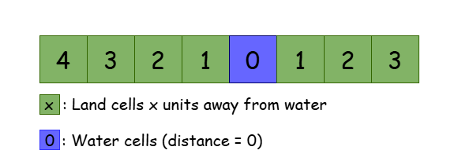
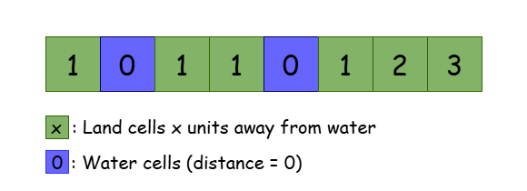
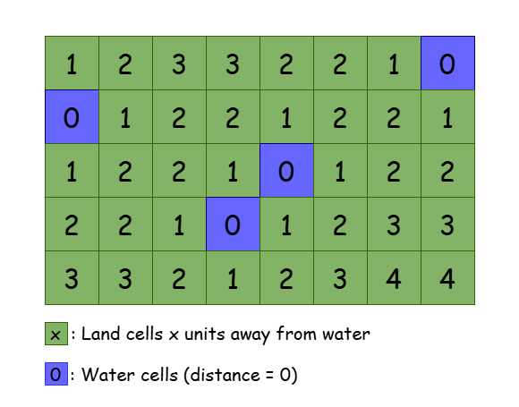

<!-- 
@Author: LeetCode 
-->

# Solution

## Overview

We are given a 2D matrix `isWater` of dimensions `m x n`, which represents a map consisting of land and water cells. Specifically:

- If `isWater[i][j] = 0`, the cell `(i, j)` represents land.
- If `isWater[i][j] = 1`, the `cell (i, j)` represents water.

The goal is to assign a height to each cell such that the highest peak on the map (i.e., the greatest height of any cell) is as high as possible. This assignment must follow these rules:

1. The height of each cell must be non-negative.
2. The height of all water cells is fixed at 0. These cells have fixed heights and cannot be changed.
3. The height difference between two adjacent cells (cells that share a side) must not be greater than one. For example, if the height of cell `(2, 3)` is `4`, then the heights of its adjacent cells—`(1, 3)`, `(3, 3)`, `(2, 4)`, and `(2, 2)`—must be either `3`, `4` or `5`.

## Approach1: Breadth-First Search

### Intuition

Let’s first break the problem down into a simpler, one-dimensional version.

Imagine a row of cells with only one water cell. Intuitively, as we move away from the water cell, the heights of the land cells should gradually increase. The height of each land cell can naturally be determined by its distance from the water cell.



Now, let’s add a second water cell to the row. The idea stays the same, but now each land cell’s height is determined by its smallest distance to any water cell. This ensures a smooth increase in height as we move away from both water cells.



When we extend this logic to two dimensions, the concept is identical. For every cell in the grid, we calculate its smallest distance to any water cell and assign that value as its height.

- Heights increase smoothly from water cells, ensuring the highest peak is at the farthest distance from all water cells.
This can be visualized as a "ripple effect" where water cells propagate their distances outward, assigning heights to nearby land cells.



This approach works intuitively for two reasons:

- It follows the rule that the height difference between two adjacent cells is at most one. This is because the minimum distance to water for any two neighboring cells cannot differ by more than one.
- It’s optimal because it ensures that the height of the cells increases consistently as we move farther from water cells, maximizing the highest peak on the map.

To find the shortest distance from any cell to a water cell, we use Breadth-First Search (BFS) starting from all water cells. When a land cell is reached for the first time, its shortest distance to a water cell is set.

> **Note**: For a more comprehensive understanding of breadth-first search, check out the [BFS Explore Card](https://leetcode.com/explore/featured/card/graph/620/breadth-first-search-in-graph/). This resource provides an in-depth look at BFS, explaining its key concepts and applications with a variety of problems to solidify understanding of the pattern.

### Algorithm

- Define two arrays of size `4`: `dx = [0, 0, 1, -1]` and `dy = [1, -1, 0, 0]`. Each pair `(dx[d], dy[d])` represents one of the four possible directions to an adjacent cell.
- Initialize a 2D matrix, named `cellHeights`, of the same dimension as `isWater`. Set all of its cells to an invalid value, i.e. `-1`.
- Initialize an empty queue of pairs, `cellQueue`.
- Iterate over the `isWater` matrix:
  - Push every water cell into the `cellQueue`.
  - Set the height of each water cell to be `0`.
- Initialize `heightOfNextLayer` to `1` - that is the height of the neighbors of the cells currently in queue.
- While the `cellQueue` is not empty:
  - Set `layerSize` to the size of the queue.
  - For each cell in the current layer, i.e. for `i` from `0` to `layerSize - 1`:
    - Pop the top cell `currentCell` out of the queue.
    - For each direction, i.e. for `d` from `0` to `3`:
      - Find the neighbor of the current cell to that direction, `neighborCell = (currentCell.x + dx[d], currentCell.y + dy[d])`.
      - If `neighbor` is a valid cell (i.e. it is not out of the bounds of the matrix) and it is not already visited (i.e. `cellHeights[neighbor.x][neighbor.y] == -1`):
        - Set `cellHeights[neighbor.x][neighbor.y]` to `heightOfNextLayer`.
        - Push neighbor into the cellQueue.
  - Increment `heightOfNextLayer` by `1`.
- Return `cellHeights`.

### Implementation

```python
class Solution:
    def highestPeak(self, is_water):
        dx = [0, 0, 1, -1]  # Horizontal movement: right, left, down, up
        dy = [1, -1, 0, 0]  # Vertical movement corresponding to dx

        rows = len(is_water)
        columns = len(is_water[0])

        # Initialize the height matrix with -1 (unprocessed cells)
        cell_heights = [[-1 for _ in range(columns)] for _ in range(rows)]

        # Queue to perform breadth-first search
        cell_queue = deque()

        # Add all water cells to the queue and set their height to 0
        for x in range(rows):
            for y in range(columns):
                if is_water[x][y] == 1:
                    cell_queue.append((x, y))
                    cell_heights[x][y] = 0

        # Initial height for land cells adjacent to water
        height_of_next_layer = 1

        # Perform BFS
        while cell_queue:
            layer_size = len(cell_queue)

            # Iterate through all cells in the current layer
            for _ in range(layer_size):
                current_cell = cell_queue.popleft()

                # Check all four possible directions for neighboring cells
                for d in range(4):
                    neighbor_x = current_cell[0] + dx[d]
                    neighbor_y = current_cell[1] + dy[d]

                    # Check if the neighbor is valid and unprocessed
                    if (
                        self._is_valid_cell(
                            neighbor_x, neighbor_y, rows, columns
                        )
                        and cell_heights[neighbor_x][neighbor_y] == -1
                    ):
                        cell_heights[neighbor_x][
                            neighbor_y
                        ] = height_of_next_layer
                        cell_queue.append((neighbor_x, neighbor_y))

            height_of_next_layer += 1  # Increment height for the next layer

        return cell_heights

    def _is_valid_cell(self, x, y, rows, columns):
        """Check if a cell is within the grid boundaries."""
        return 0 <= x < rows and 0 <= y < columns
```

### Complexity Analysis

Let `m` be the number of rows and `n` the number of columns in the `isWater` matrix.

- Time Complexity: `O(m×n)`
  We perform a single multi-source BFS traversal over the cells of the matrix. The time complexity of BFS is `O(V+E)`, where `V` is the number of vertices (cells in the grid, `m×n`) and `E` is the number of edges (connections between neighboring cells).
  
  In a grid, each cell has at most 4 neighbors, resulting in at most 4⋅m×n edges. Since E is proportional to V in a grid, the total time complexity simplifies to O(m×n).

- Space Complexity: `O(m×n)`
  We use a 2D matrix `cellHeights` of size `m×n` to store the calculated heights. Additionally, the BFS queue can hold up to `m×n` cells in the worst case. Therefore, the overall space complexity is `O(m×n)`.

## Approach 2: Dynamic Programming

### Intuition

In this approach, we build on the idea that the height of each cell should be the smallest distance to any water cell. From there, we observe that once we know the smallest distances of a cell’s neighboring cells, calculating the distance for the current cell becomes straightforward — it’s just the smallest of the neighbors’ distances plus one. The core idea is to use dynamic programming to compute these distances efficiently.

Dynamic programming works well here because:

1. Each cell's height can be derived from the heights of its neighboring cells.
2. By iterating over the grid in a specific order, we can ensure that all necessary states are computed before being used.

However, the challenge is figuring out the correct order to compute these states. In DP terms, we need to ensure all necessary states are computed before using them.

Let’s simplify by imagining we can only move down or right. In that case, the top-left corner has no choices — it’s either a water cell or not reachable. Similarly, for the first row and column, we only have options from neighboring cells directly below or to the right.

Using this, we can fill the DP table row by row and column by column, in common order.

Finally, we perform a second pass, moving upward or left, to correct any distances that were overestimated during the first pass, which only considered partial directions (top and left).

### Algorithm

- Initialize `rows` to the number of rows and `columns` to the number of columns of the `isWater` matrix.
- Initialize a 2D matrix, named `cellHeights`, of the same dimension as `isWater`. Set all of its cells to a large value, i.e. INF.
- Iterate over the `cellHeights` matrix and set the height of all water cells to 0.
- Loop with `row` from `0` to `rows - 1`:
  - Loop with `col` from `0` to `columns - 1`:
    - Initialize `minNeighborDistance` to `INF`.
    - Find the neighbor above the current cell, i.e. `neighborRow = row - 1`, `neighborCol = col`.
    - If the neighbor is valid, i.e. if it is not out of the bounds of the grid:
    - Set `minNeighborDistance` to the minimum of itself and `cellHeights[neighborRow][neighborCol]`.
    - Find the neighbor to the left of the current cell, i.e. `neighborRow = row, neighborCol = col - 1`.
    - If the neighbor is valid:
      - Set `minNeighborDistance` to the minimum of itself and `cellHeights[neighborRow][neighborCol]`.
      - Set the height of the current cell to the minimum of its current value `minNeighborDistance + 1`.
  - Perform the second pass over cellHeights moving in the opposite directions:
  - Loop with `row` from `rows - 1` to `0`:
    - Loop with `col` from `columns - 1` to `0`:
      - Initialize `minNeighborDistance` to `INF`.
      - Find the neighbor below the current cell, i.e. `neighborRow = row + 1`, `neighborCol = col`.
      - If the neighbor is valid:
        - Set `minNeighborDistance` to the minimum of itself and `cellHeights[neighborRow][neighborCol]`.
      - Find the neighbor to the right of the current cell, i.e. `neighborRow = row`, `neighborCol = col + 1`.
      - If the neighbor is valid:
        - Set `minNeighborDistance` to the minimum of itself and `cellHeights[neighborRow][neighborCol]`.
      - Set the height of the current cell to the minimum of its current value `minNeighborDistance + 1`.
- Return `cellHeights`.

### Implementation

```python
class Solution:
    def highestPeak(self, is_water: List[List[int]]) -> List[List[int]]:
        rows = len(is_water)
        columns = len(is_water[0])
        INF = rows * columns  # Large value to represent uninitialized heights

        # Initialize the cellHeights matrix with INF (unprocessed cells)
        cell_heights = [[INF] * columns for _ in range(rows)]

        # Set the height of water cells to 0
        for row in range(rows):
            for col in range(columns):
                if is_water[row][col] == 1:
                    cell_heights[row][col] = 0  # Water cells have height 0

        # Forward pass: updating heights based on top and left neighbors
        for row in range(rows):
            for col in range(columns):
                # Initialize minimum neighbor distance
                min_neighbor_distance = INF

                # Check the cell above
                neighbor_row = row - 1
                neighbor_col = col
                if self.is_valid_cell(
                    neighbor_row, neighbor_col, rows, columns
                ):
                    min_neighbor_distance = min(
                        min_neighbor_distance,
                        cell_heights[neighbor_row][neighbor_col],
                    )

                # Check the cell to the left
                neighbor_row = row
                neighbor_col = col - 1
                if self.is_valid_cell(
                    neighbor_row, neighbor_col, rows, columns
                ):
                    min_neighbor_distance = min(
                        min_neighbor_distance,
                        cell_heights[neighbor_row][neighbor_col],
                    )

                # Set the current cell's height as the minimum of its neighbors + 1
                cell_heights[row][col] = min(
                    cell_heights[row][col], min_neighbor_distance + 1
                )

        # Backward pass: updating heights based on bottom and right neighbors
        for row in range(rows - 1, -1, -1):
            for col in range(columns - 1, -1, -1):
                # Initialize minimum neighbor distance
                min_neighbor_distance = INF

                # Check the cell below
                neighbor_row = row + 1
                neighbor_col = col
                if self.is_valid_cell(
                    neighbor_row, neighbor_col, rows, columns
                ):
                    min_neighbor_distance = min(
                        min_neighbor_distance,
                        cell_heights[neighbor_row][neighbor_col],
                    )

                # Check the cell to the right
                neighbor_row = row
                neighbor_col = col + 1
                if self.is_valid_cell(
                    neighbor_row, neighbor_col, rows, columns
                ):
                    min_neighbor_distance = min(
                        min_neighbor_distance,
                        cell_heights[neighbor_row][neighbor_col],
                    )

                # Set the current cell's height as the minimum of its neighbors + 1
                cell_heights[row][col] = min(
                    cell_heights[row][col], min_neighbor_distance + 1
                )

        return cell_heights  # Return the calculated cell heights

    # Function to check if a cell is within grid bounds
    def is_valid_cell(
        self, row: int, col: int, rows: int, columns: int
    ) -> bool:
        return 0 <= row < rows and 0 <= col < columns
```

### Complexity Analysis

Let m be the number of rows and n the number of columns in the isWater matrix.

- Time Complexity: `O(m×n)`
  We iterate over the cells of the matrix 3 times and perform constant-time operations, including comparisons and assignments, on each iteration. Therefore, the time complexity of the algorithm is `O(m×n)`.

- Space Complexity: `O(m×n)`
  We use a 2D matrix `cellHeights` of size `m×n` to store the calculated heights resulting in a space complexity of `O(m×n)`. Unlike the previous approach that used a queue as an additional data structure, this method only relies on the input grid and the resulting matrix, keeping the space complexity factor lower.
