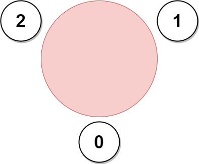

<!-- @leetcode -->

# Problem

A company is organizing a meeting and has a list of `n` employees, waiting to be invited. They have arranged for a large **circular** table, capable of seating **any number** of employees.

The employees are numbered from `0` to `n - 1`. Each employee has a **favorite** person and they will attend the meeting **only if** they can sit next to their favorite person at the table. The favorite person of an employee is **not** themself.

Given a **0-indexed** integer array `favorite`, where `favorite[i]` denotes the favorite person of the $i^{th}$ employee, return **the maximum number of employees** that can be invited to the meeting.

## Example 1:



**Input**: favorite = [2,2,1,2]

**Output**: 3

**Explanation**:The above figure shows how the company can invite employees 0, 1, and 2, and seat them at the round table.
All employees cannot be invited because employee 2 cannot sit beside employees 0, 1, and 3, simultaneously.
Note that the company can also invite employees 1, 2, and 3, and give them their desired seats.
The maximum number of employees that can be invited to the meeting is 3. 

## Example 2:

Example 2:

**Input**: favorite = [1,2,0]

**Output**: 3

**Explanation**: Each employee is the favorite person of at least one other employee, and the only way the company can invite them is if they invite every employee.

The seating arrangement will be the same as that in the figure given in example 1:

- Employee 0 will sit between employees 2 and 1.
- Employee 1 will sit between employees 0 and 2.
- Employee 2 will sit between employees 1 and 0.
The maximum number of employees that can be invited to the meeting is 3.

## Example 3:


**Input**: favorite = [3,0,1,4,1]

**Output**: 4

**Explanation**:The above figure shows how the company will invite employees 0, 1, 3, and 4, and seat them at the round table.
Employee 2 cannot be invited because the two spots next to their favorite employee 1 are taken.
So the company leaves them out of the meeting.

The maximum number of employees that can be invited to the meeting is 4.

## Constraints:

- `n == favorite.length`
- `2 <= n <= 105`
- `0 <= favorite[i] <= n - 1`
- `favorite[i] != i`

# Solution

## Overview

A company is planning a round table meeting for a group of employees who will only come if they can sit next to their favorite coworker at the circular table. Given the number of people the company hopes will attend and each employee's favorite coworker, we must return the largest number of people who can attend while sticking to the requirement that each person must be seated next to their favorite coworker.

At this point, we can observe that the problem can be seen as a directed graph where each employee points to their favorite person. The key observation here is that this graph has cycles, and those cycles are important because any group of employees in a cycle can sit next to each other in the meeting. So, detecting these cycles will be central to solving the problem.

However, we also need to account for the fact that there might be chains of employees, not forming cycles by themselves, but who are connected in such a way that they can potentially be linked to form a larger cycle. This gives us the idea that even if a group of employees doesn’t form a cycle initially, they might still be part of a larger group that can be arranged in a circle.

A final thing to note is that the circular nature of the seating arrangement may influence how you connect the employees, especially when identifying 'groups' or 'cycles' that can sit next to each other.

We have two main types of structures that can form when we try to seat employees based on their favorite people:

1. **A one-way connected cycle**: This is where employees form a directed chain, like `a -> b -> c -> d -> a`. This means each person’s favorite is part of a larger cycle, and everyone must sit next to someone else in the cycle. These cycles will only be able to seat as many employees as the cycle's size.

2. **A mutual two-way cycle**: In this case, two people like each other mutually, meaning `a <-> b`. This is a two-way connection, forming a 2-cycle group. These types of cycle groups allow us to put more people on the table because we can treat them as a smaller unit that can connect to other parts of the graph.

Let’s go over two examples to break this down more clearly.

**Example 1**: `[1, 0, 3, 2, 5, 6, 7, 4, 9, 8, 11, 10, 11, 12, 10]`
We can visualize this as a graph where each node has an edge pointing to their favorite person.

If person `A` likes `B`, we construct an edge of `A -> B`. Then we can construct a graph like below: 

1. **Cycle with size > 2 (green cycle)**:

- For cycles like this, no additional employees can be added to the cycle because everyone must sit next to their favorite person, and adding others would disrupt that. For instance, in the cycle (`4, 5, 6, 7)`, no one else can sit in that cycle unless we break it, which is not allowed.

2. **Cycle with size == 2 (red cycle)**:

- For these types of cycles, we can have multiple 2-cycles sitting next to each other. These cycles can connect with extended paths (chains of employees) as long as they don’t disrupt the seating order.
- For example, we can allocate the employees like `[(0, 1), (2, 3), (8, 9), [13, 12, (11, 10), 14]]`
- Notice that we can also put extended paths (like the blue circles in the diagram) next to the two endpoints of the 2-cycle. This allows us to extend the cycle by adding more people without violating the seating constraints.

**Example 2**: `[9, 14, 15, 8, 22, 15, 12, 11, 10, 7, 1, 12, 15, 6, 5, 12, 10, 21, 4, 1, 16, 3, 7]`

Check out the below diagram, as we will be referring to it in the future for explanation: 

In this example, there are more complex cycles and paths to consider. We need to find the longest possible extended paths for each endpoint of a 2-cycle and combine them efficiently.

**Extended Path for 2-Cycles**:

- For instance, for the 2-cycle `(12, 15)` (blue rectangle), we need to find the longest paths from each of these employees. Starting from `12`, we can trace a path: `[18, 4, 22, 7, 11, 12]`, and from `15`, we trace a path: `[17, 21, 3, 8, 10, 1, 14, 5, 15]`.

The idea is that these paths can be connected to the cycle, forming larger groups of people that can sit together.

So our core solution consists of three parts:

1. Cycle Detection:

- Since every node points to exactly one other node (the favorite person), the graph is simple. We can detect cycles by walking through the graph from unexplored nodes and stopping when we revisit an already visited node. This works well because each node has at most one outgoing edge, simplifying the process.

2. Finding the Longest Path:

- Once we have detected all the cycles, we need to handle two cases:
  - Single cycle with size > 2: We treat it as a unit and cannot add more people.
  - Multiple 2-cycles: We look for the longest extended path for each endpoint of a 2-cycle, using BFS or DFS to find the longest path starting from each of the two mutual-favoriting people. The maximum possible length for any group is the sum of the longest paths from both endpoints plus `2` (for the mutual-favoriting people themselves).


3. Final Comparison:

- Once we have the maximum length from extended paths and the size of the largest cycle, we simply compare these two values. The answer is the larger of the two, as that represents the maximum number of employees that can be seated together.

## Approach 1: Cycle Detection with Extended Paths

### Intuition

From the overview, the problem boils down to identifying cycles in the directed graph, determining how chains can be connected, and ensuring that employees are seated next to their favorites.

To implement this, we first need to create a graph that represents the relationships between people based on their favorite person. This is done by constructing a reversed graph where each person points to the people who have them as their favorite. This structure allows us to easily trace back to the people that lead into each person’s chain.

Next, we iterate through the graph nodes. If a node hasn’t been visited, we start a traversal, tracking visited nodes and the distance from the start using a map.

- If a node is visited during the traversal, we've detected a cycle. The cycle length is the difference in the distances at which we first encounter and revisit the node.
- A cycle length greater than 2 forms a self-contained group, which we compare with the largest cycle found.

When we detect a two-node cycle (mutual favorites), the approach changes slightly. In this case, the cycle itself only accounts for two people, so we look for the longest chains that lead into both people of the cycle. This is done by implementing a **BFS** function that explores the reversed graph and finds the maximum path leading into each of the two nodes forming the cycle. The length of the chain for each node is determined by how far we can trace back in the graph.

- Once we know the longest chain for each of the two nodes, we calculate the total size of the group by adding the two chain lengths plus 2 (for the two people in the cycle itself). This extended group size is then added to the total count of two-node cycle groups.

Finally, the result is the larger of the largest standalone cycle or the largest extended group from the two-node cycle. This ensures the largest valid seating arrangement is found.

## Algorithm

- Initialize a variable `n` to store the size of the favorite array, and create a `reversedGraph` to store the reversed edges (in this case, favorite relationships).

- Build the reversed graph:
  - Iterate through each person in the favorite array, and for each person, add them to the reversed graph using `favorite[person]` as the key.

- Define a helper function `bfs` to perform breadth-first search:
  - Initialize a queue to hold the node and its distance.
  - Process each node in the queue and explore its neighbors (reverse of the favorite relationship).
  - Track the maximum distance during BFS and return this value after all nodes have been visited.

- Initialize `longestCycle` to keep track of the length of the longest cycle found.

- Initialize `twoCycleInvitations` to store the count of invitations for cycles of length 2.

- Iterate through each person in the favorite array:
  - If the person hasn't been visited, start detecting a cycle from that person:
    - Use a map `visitedPersons` to track the distance from the current node.
    - Traverse through the favorite relationships to detect cycles.
    - If a cycle is detected, calculate its length and update longestCycle.
    - If the cycle length is 2, calculate invitations from both nodes of the cycle by performing BFS from each node, ensuring that both nodes are marked as visited.

- Return the maximum of longestCycle and twoCycleInvitations.

```python
class Solution:
    def maximumInvitations(self, favorite: List[int]) -> int:
        # Calculate the maximum distance from a given start node
        def _bfs(
            start_node: int, visited_nodes: set, reversed_graph: List[List[int]]
        ) -> int:
            # Queue to store nodes and their distances
            queue = deque([(start_node, 0)])
            max_distance = 0
            while queue:
                current_node, current_distance = queue.popleft()
                for neighbor in reversed_graph[current_node]:
                    if neighbor in visited_nodes:
                        continue  # Skip already visited nodes
                    visited_nodes.add(neighbor)
                    queue.append((neighbor, current_distance + 1))
                    max_distance = max(max_distance, current_distance + 1)
            return max_distance

        num_people = len(favorite)
        reversed_graph = [[] for _ in range(num_people)]

        # Build the reversed graph where each node points to its admirers
        for person in range(num_people):
            reversed_graph[favorite[person]].append(person)

        longest_cycle = 0
        two_cycle_invitations = 0
        visited = [False] * num_people

        # Find all cycles in the graph
        for person in range(num_people):
            if not visited[person]:

                # Track visited persons and their distances
                visited_persons = {}
                current_person = person
                distance = 0
                while True:
                    if visited[current_person]:
                        break
                    visited[current_person] = True
                    visited_persons[current_person] = distance
                    distance += 1
                    next_person = favorite[current_person]

                    # Cycle detected
                    if next_person in visited_persons:
                        cycle_length = distance - visited_persons[next_person]
                        longest_cycle = max(longest_cycle, cycle_length)

                        # Handle cycles of length 2
                        if cycle_length == 2:
                            visited_nodes = {current_person, next_person}
                            two_cycle_invitations += (
                                2
                                + _bfs(
                                    next_person, visited_nodes, reversed_graph
                                )
                                + _bfs(
                                    current_person,
                                    visited_nodes,
                                    reversed_graph,
                                )
                            )
                        break
                    current_person = next_person

        return max(longest_cycle, two_cycle_invitations)
```

## Complexity Analysis

Let `n` be the size of the favorite array.

- Time complexity: `O(n)`
  We build a reversed graph where each node points to its favorite. This involves iterating over all `n` elements and adding edges, which takes `O(n)` time.
  
  The outer loop iterates over all n people, and the inner while loop processes each person in the cycle exactly once. This ensures that each node is visited at most once, resulting in `O(n)` time for cycle detection.
  
  For cycles of length 2, we perform a BFS to calculate the maximum distance from each node in the cycle. Since each node is visited at most once during the BFS, and the BFS is performed only for 2-length cycles, the total time for this step is also O`(n)`.
  
  Since all these steps are sequential and each takes `O(n)` time, the overall time complexity is `O(n)`.

- Space complexity: `O(n)`
  The reversed graph is stored as an adjacency list, which requires `O(n)` space. The visited array tracks whether a node has been processed, requiring `O(n)` space. The visitedPersons map stores the distance of each node in the current cycle, which can take up to `O(n)` space in the worst case. The BFS queue and the visitedNodes set used for 2-length cycle processing can store up to `O(n)` nodes in total.
  
  Therefore, the overall space complexity is O(n).

## Approach 2: Topological Sort to Reduce Non-Cyclic Nodes

### Intuition for Topological Sort

[Topological sort](https://leetcode.com/explore/featured/card/graph/623/kahns-algorithm-for-topological-sorting/) is an algorithm traditionally used in DAGs (Directed Acyclic Graphs) to order nodes in a way that for every directed edge `u` to `v`, node `u` comes before node `v`. This ordering allows us to process nodes one by one, ensuring that we handle dependencies before processing dependent nodes.

However, in this context, we don't have a pure DAG because of the cycles. But we can still use topological sorting to help with eliminating non-cycle nodes and focusing on cycles that we need to handle more carefully. In fact, identifying and processing these cycles is key to finding the solution.

The idea is to first process nodes in topological order to remove non-cycle nodes and focus on the cycles that need further examination.

To implement this, we begin by calculating the in-degree for each node. The in-degree of a node indicates how many nodes point to it. In this case, the "favorite" relationship can be seen as a directed edge from one person to another. After populating the in-degree array, we initialize a queue that will help us with the topological sort. The queue initially contains all nodes that have an in-degree of zero (i.e., nodes with no incoming edges). These are the nodes that do not form part of any cycle and can be processed in topological order.

Next, we start the process of topologically sorting the nodes while calculating the depth of each node. The depth represents the longest path from any starting node to that particular node. As we process each node, we **decrement the in-degree** of its neighbor (as we "remove" the edge), and if any neighbor's in-degree becomes zero, it is added to the queue. During this process, we also update the depth of each node, ensuring that it reflects the longest path leading to that node.

Once the topological sort is completed and we have processed all non-cycle nodes, we move on to detect cycles. For each node that remains in the graph (i.e., nodes with a non-zero in-degree), we trace the cycle by following the favorite links. As we trace the cycle, we mark the nodes as visited by setting their in-degree to zero, and count the length of the cycle.

If the cycle length is `2`, we know it’s a two-person mutual favorite cycle. In this case, we add the combined depths of both nodes in the cycle to the total invitation count for two-cycles. This is because both nodes can invite the maximum number of people based on their depths.

For longer cycles, we simply update the longest cycle length, since a longer cycle can accommodate more people in the seating arrangement.

At the end, the result is the maximum of the longest cycle length and the total size of the two-cycle groups.

## Algorithm for Topological Sort

- Initialize a variable `n` to store the size of the favorite array and create an `inDegree` array to store the in-degree of each node.

- Calculate the in-degree for each node:
  - For each person, increment the in-degree of their favorite node.

- Perform topological sorting to process non-cycle nodes:
  - Use a queue `q` to store nodes with in-degree 0 (no incoming edges).
  - For each node in the queue, update the depth of its favorite node and reduce its in-degree. If the in-degree of the favorite node becomes `0`, add it to the queue.

- Initialize `longestCycle` and `twoCycleInvitations` to 0.

- Detect cycles:
  - For each person, if their in-degree is non-zero (indicating they are part of a cycle):
    - Track the cycle length while marking each node in the cycle as visited by setting its in-degree to `0`.
    - If the cycle length is `2`, add the depth of both nodes involved in the cycle to `twoCycleInvitations`.
    - If the cycle length is greater than `2`, update `longestCycle` with the maximum cycle length found.

- Return the maximum of `longestCycle` and `twoCycleInvitations`.

```python
class Solution:
    def maximumInvitations(self, favorite: List[int]) -> int:
        n = len(favorite)
        in_degree = [0] * n

        # Calculate in-degree for each node
        for person in range(n):
            in_degree[favorite[person]] += 1

        # Topological sorting to remove non-cycle nodes
        q = deque()
        for person in range(n):
            if in_degree[person] == 0:
                q.append(person)
        depth = [1] * n  # Depth of each node

        while q:
            current_node = q.popleft()
            next_node = favorite[current_node]
            depth[next_node] = max(depth[next_node], depth[current_node] + 1)
            in_degree[next_node] -= 1
            if in_degree[next_node] == 0:
                q.append(next_node)

        longest_cycle = 0
        two_cycle_invitations = 0

        # Detect cycles
        for person in range(n):
            if in_degree[person] == 0:  # Already processed
                continue

            cycle_length = 0
            current = person
            while in_degree[current] != 0:
                in_degree[current] = 0  # Mark as visited
                cycle_length += 1
                current = favorite[current]

            if cycle_length == 2:
                # For 2-cycles, add the depth of both nodes
                two_cycle_invitations += depth[person] + depth[favorite[person]]
            else:
                longest_cycle = max(longest_cycle, cycle_length)

        return max(longest_cycle, two_cycle_invitations)
```

## Complexity Analysis for Topological Sort

Let `n` be the size of the favorite array.

- Time complexity: `O(n)`
  
  The first loop iterates over all `n` elements to calculate the in-degree of each node. This takes `O(n)` time.
  
  The second loop iterates over all n elements to initialize the queue with nodes that have an in-degree of `0`. The subsequent BFS-like traversal processes each node and edge exactly once, which also takes `O(n)` time.
  
  The final loop iterates over all `n` elements to detect cycles. Each node is visited at most once, and the inner while loop processes each node in the cycle exactly once. This also takes `O(n)` time.
  
  Since all these steps are sequential and each takes `O(n)` time, the overall time complexity is `O(n)`.

- Space complexity: `O(n)`
  
  The inDegree array stores the in-degree of each node, which requires `O(n)` space. The depth array stores the depth of each node, which also requires `O(n)` space. The queue used for topological sorting can store up to `O(n)` nodes in the worst case. The variables used for cycle detection and other operations require constant space, which is negligible compared to the arrays and queue.
  
  Therefore, the overall space complexity is `O(n)`.
