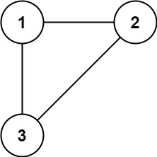
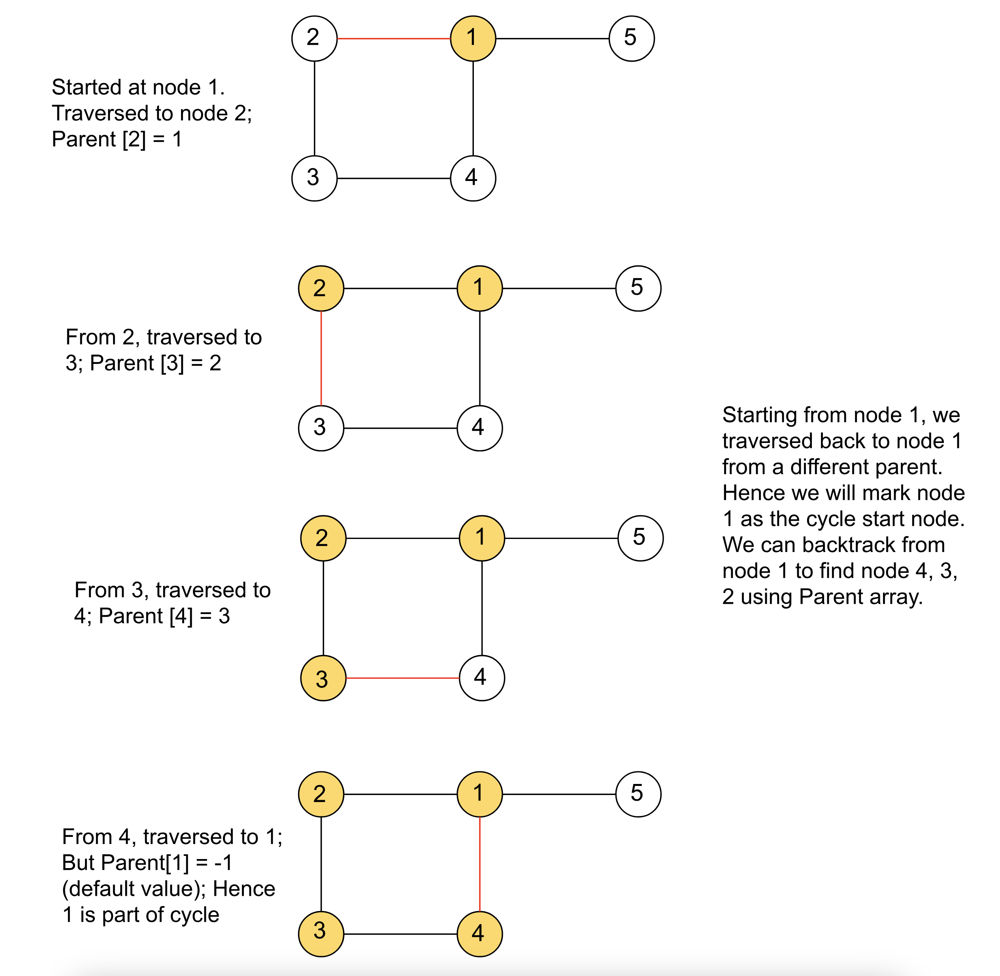

<!-- @leetcode -->

# Problem: Redundant Connection

In this problem, a tree is an **undirected graph** that is connected and has no cycles.

You are given a graph that started as a tree with `n` nodes labeled from `1` to `n`, with one additional edge added. The added edge has two different vertices chosen from `1` to `n`, and was not an edge that already existed. The graph is represented as an array edges of length `n` where `edges[i] = [ai, bi]` indicates that there is an edge between nodes `ai` and `bi` in the graph.

Return an edge that can be removed so that the resulting graph is a tree of `n` nodes. If there are multiple answers, return the answer that occurs last in the input.

**Example 1:**



**Input**: edges = [[1,2],[1,3],[2,3]]
**Output**: [2,3]

**Example 2:**


**Input**: edges = [[1,2],[2,3],[3,4],[1,4],[1,5]]
**Output**: [1,4]

**Constraints:**

- `n == edges.length`
- `3 <= n <= 1000`
- `edges[i].length == 2`
- `1 <= ai < bi <= edges.length`
- `ai != bi`
- There are no repeated edges.
- The given graph is connected.

# Solution

## Overview

We are given a graph consisting of `N` nodes and `N−1` edges, which means the graph initially forms a tree. A tree is a special type of graph that is connected (there is a path between any two nodes) and **acyclic** (it does not contain any cycles). However, a new edge is added to the tree, connecting two nodes that are already part of the graph. This new edge creates a cycle because there are now two distinct paths between some pairs of nodes. As a result, the graph is no longer a tree but a single-cycle graph.

Our goal is to identify the edge that, if removed, will restore the graph to its original state as a tree. Since the tree must be connected and acyclic, removing any edge from the cycle will break the cycle and turn the graph into a tree. However, if there are multiple edges that can be removed to achieve this, we are required to return the edge that appears last in the given list of edges.

## Approach 2: Depth-First Search - Single Traversal

## Intuition

We cannot remove just any edge from the graph, as doing so might disconnect the graph. The edge we remove must be part of the cycle. If we can identify the edges or nodes involved in the cycle, we can choose to remove the edge that appears last in the input edge list.

To detect the cycle in the graph, we need to identify at least one node that belongs to it. This can be accomplished using DFS while keeping track of the parent of each node, where the parent represents the node from which we reached the current node. **If we encounter a node that has already been visited and the node we are coming from is different from its parent, we can conclude that the node is part of the cycle.**

Once we identify a node in the cycle, we can backtrack through the parent array to find all the other nodes that are part of the cycle, until we return to the starting node. We will mark all these cycle nodes in an unordered map. Then, we iterate over the edges in reverse order, and if both nodes of an edge are marked in the map, we can discard this edge as it forms the cycle. Finally, we can return this redundant edge. 

## Algorithm

1. Initialize Variables:
   - Set `cycleStart` to `-1` to mark the start of the cycle.
   - Create a visited array to keep track of visited nodes.
   - Create a `parent` array to store the parent of each node in the DFS traversal.
   - Initialize an adjacency list `adjList` to represent the graph.

2. Build the Graph:
   - Loop through each edge in the input edges list.
   - For each edge `[u, v]`, add `v` to `adjList[u]` and `u` to `adjList[v]` to make the graph undirected.

3. Start a DFS from node `0` (or any node, as the graph is connected).
   - In the DFS function:
     - Mark the current node as visited.
     - For each adjacent node, check if it's visited:
       - If not visited, recursively call DFS on the adjacent node, and update its parent.
       - If the node is visited and its parent is different from the previous one, mark it as `cycleStart` to identify the cycle.

4. Track Cycle Nodes:
   - Using the `parent` array, backtrack from `cycleStart` to collect all nodes in the cycle.
   - Store these nodes in the `cycleNodes` map for quick lookup.

5. Identify the Redundant Edge:
   - Iterate through the edges in reverse order.
   - For each edge, check if both nodes of the edge are in the `cycleNodes` map:
     - If both nodes are in the cycle, return this edge as the redundant connection.

```python
class Solution:
    cycle_start = -1

    # Perform the DFS and store a node in the cycle as cycleStart.
    def _DFS(self, src, visited, adj_list, parent):
        visited[src] = True

        for adj in adj_list[src]:
            if not visited[adj]:
                parent[adj] = src
                self._DFS(adj, visited, adj_list, parent)
                # If the node is visited and the parent is different then the
                # node is part of the cycle.
            elif adj != parent[src] and self.cycle_start == -1:
                self.cycle_start = adj
                parent[adj] = src

    def findRedundantConnection(self, edges):
        N = len(edges)

        visited = [False] * N
        parent = [-1] * N

        adj_list = [[] for _ in range(N)]
        for edge in edges:
            adj_list[edge[0] - 1].append(edge[1] - 1)
            adj_list[edge[1] - 1].append(edge[0] - 1)

        self._DFS(0, visited, adj_list, parent)

        cycle_nodes = {}
        node = self.cycle_start
        # Start from the cycleStart node and backtrack to get all the nodes in
        # the cycle. Mark them all in the map.
        while True:
            cycle_nodes[node] = 1
            node = parent[node]
            if node == self.cycle_start:
                break

        # If both nodes of the edge were marked as cycle nodes then this edge
        # can be removed.
        for i in range(len(edges) - 1, -1, -1):
            if (edges[i][0] - 1) in cycle_nodes and (
                edges[i][1] - 1
            ) in cycle_nodes:
                return edges[i]

        return []  # This line should theoretically never be reached
```

## Complexity Analysis

Here, `N` is the number of nodes and edges in the given graph.

- Time complexity: `O(N)`.
  We perform the DFS starting from node `0` only once, which has a time complexity of `O(N)`. Then, we iterate over the cycle nodes using the parent array, with a maximum of `N` iterations if all nodes are part of the cycle. Finally, we iterate over all edges and check the map in `O(1)` time for each edge. Therefore, the total time complexity is `O(N)`.

- Space complexity: `O(N)`
  - The adjacency list `adjList` will store `N` edges, and the size of the visited array is `N`. Additionally, space is required for the active stack calls during DFS, which can be as large as one per node. The map `cycleNodes` can contain at most `N` entries. Therefore, the total space complexity is `O(N)`.
